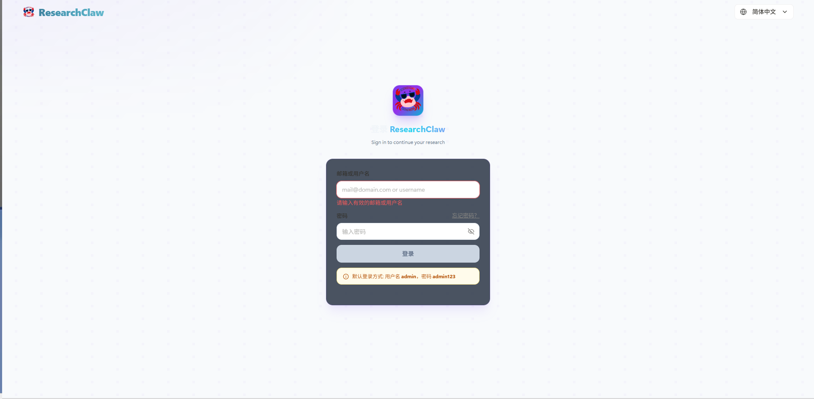
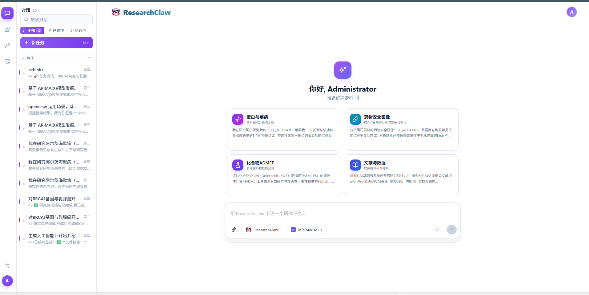
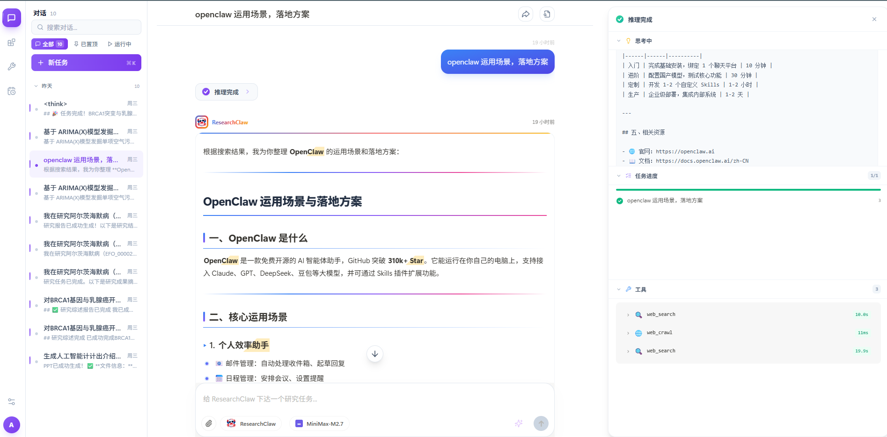
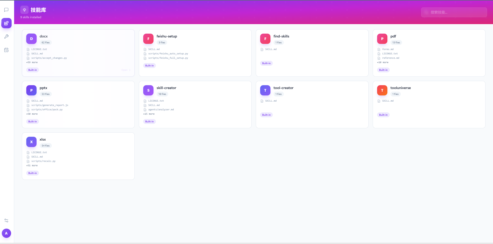
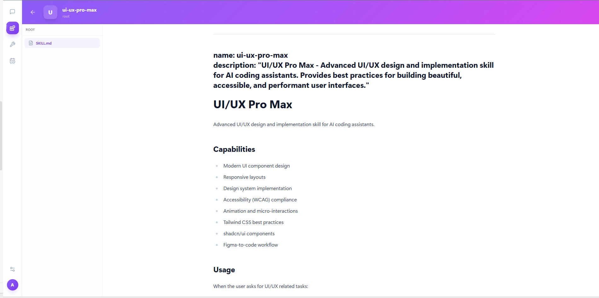
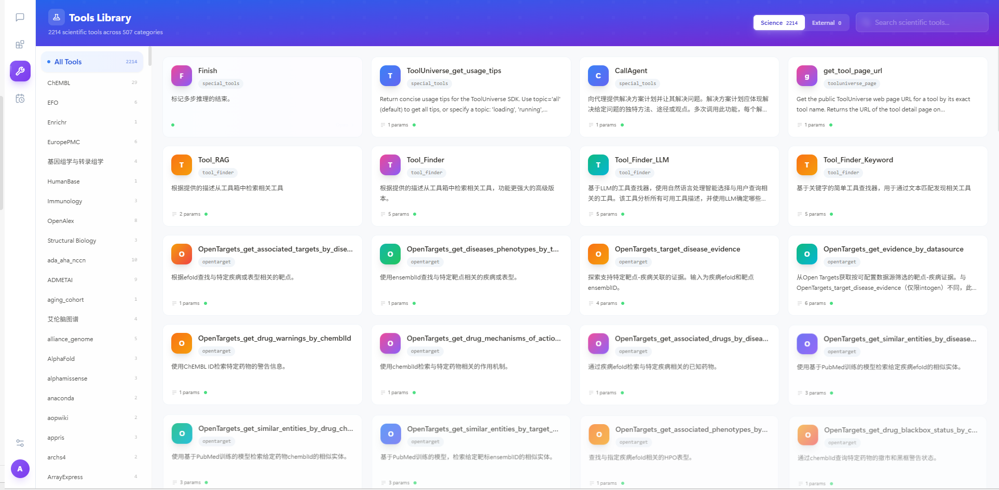
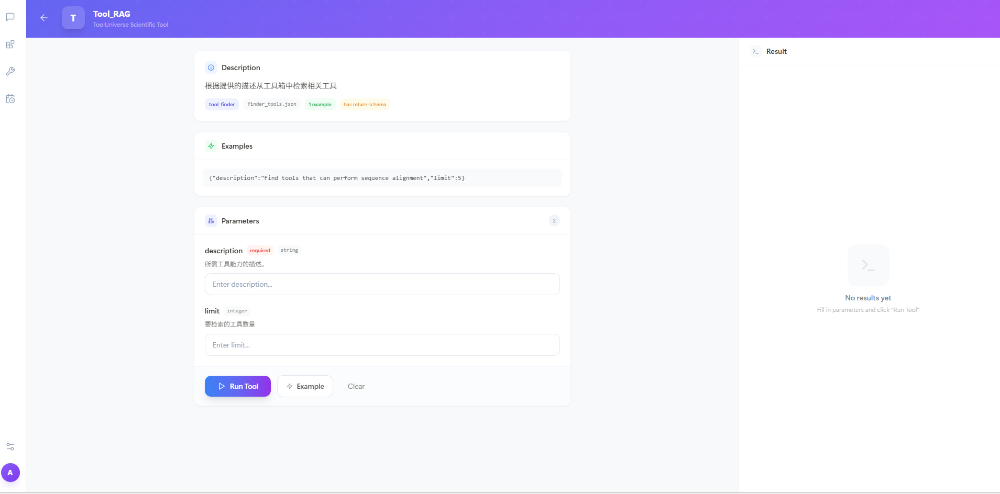
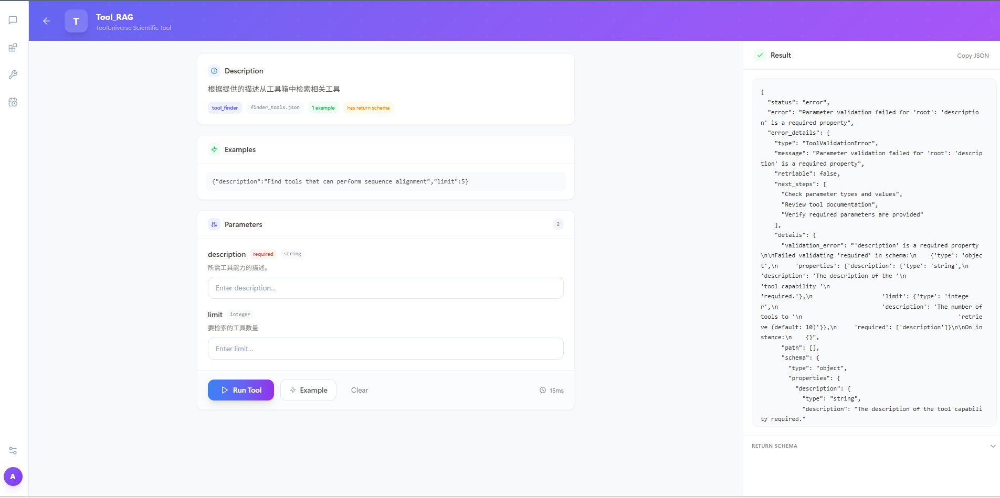
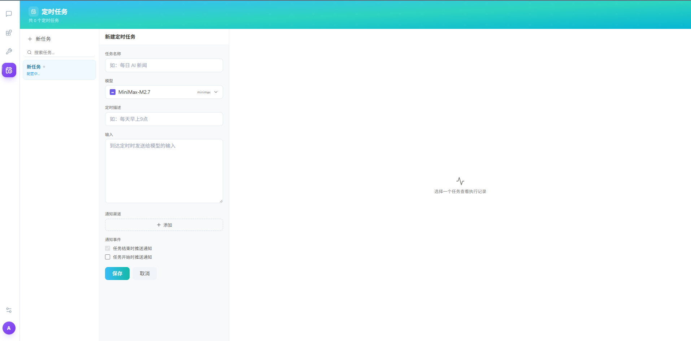
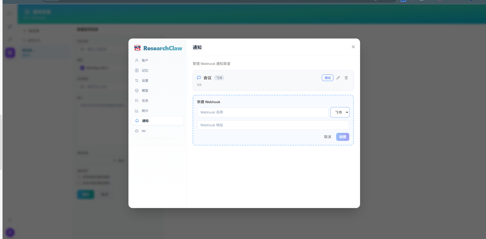

# ResearchClaw UI 设计文档

> 项目: #ResearchClaw
> 版本: v1.0
> 更新日期: 2026-04-02
> 状态: 待补充截图

---

## 📸 截图存放位置

```
C:\Work\note\ObsidianNoteBook\记忆库\语义记忆\ResearchClaw\
├── ResearchClaw-UI设计文档.md   ← 本文档
└── design\
    └── assets\                  ← 截图放这里
        ├── 01-login-page.png
        ├── 02-main-layout.png
        ├── 03-chat-page.png
        ├── 04-skills-page.png
        ├── 05-skill-detail.png
        ├── 06-tools-page.png
        ├── 06-tools-page-external.png
        ├── 07-tool-detail.png
        ├── 08-tasks-list.png
        ├── 09-task-config.png
        ├── 09-webhook-dropdown.png
        ├── 10-dag-page.png
        ├── 10-add-task-dialog.png
        ├── 10-task-detail-panel.png
        ├── 11-team-page.png
        ├── 11-add-member-dialog.png
        └── 11-assign-task-dialog.png
```

---

## 目录

1. [登录页面](#1-登录页面-loginpage)
2. [主布局与左侧导航](#2-主布局与左侧导航)
3. [对话页面（ChatPage）](#3-对话页面chatpage)
4. [技能库页面（SkillsPage）](#4-技能库页面skillspage)
5. [技能详情页（SkillDetailPage）](#5-技能详情页skilldetailpage)
6. [工具库页面（ToolsPage）](#6-工具库页面toolspage)
7. [工具详情页（ToolDetailPage）](#7-工具详情页tooldetailpage)
8. [定时任务页面（TasksPage）](#8-定时任务页面taskslistpage)
9. [新建定时任务页面（TaskConfigPage）](#9-新建定时任务页面taskconfigpage)

---

## 1. 登录页面（LoginPage）

**路由:** `/login`

### 页面说明

用户访问系统时的入口页面，提供登录、注册、密码重置功能。页面采用深色主题，以紫色渐变为主色调。

### 截图



### 页面结构

```
┌──────────────────────────────────────────────────────┐
│                                                      │
│              ResearchClaw Logo + 标题                │
│                                                      │
│     ┌────────────────────────────────────────┐       │
│     │  Email or Username                      │       │
│     └────────────────────────────────────────┘       │
│     ┌────────────────────────────────────────┐       │
│     │  Password                      [👁/👁‍] │       │
│     └────────────────────────────────────────┘       │
│                                                      │
│               [ 登 录 ]  (渐变按钮)                  │
│                                                      │
│            还没有账号？ [立即注册]                    │
│            [忘记密码?]                               │
│                                                      │
└──────────────────────────────────────────────────────┘
```

### 页面元素详解

| 序号 | 元素名称 | 类型 | 说明 |
|------|---------|------|------|
| 1 | Logo + 标题 | 图片+文本 | ResearchClaw 品牌标识 |
| 2 | 用户名输入框 | Input | 支持邮箱或用户名 |
| 3 | 密码输入框 | Input | 支持 Show/Hide 切换 |
| 4 | 登录按钮 | Button | 蓝紫渐变，主操作按钮 |
| 5 | 注册链接 | Link | 跳转注册页面 |
| 6 | 忘记密码链接 | Link | 跳转密码重置页面 |

### 交互说明

1. 用户输入用户名/邮箱 + 密码
2. 点击「登录」按钮提交
3. 系统验证通过后跳转首页 `/chat`
4. 验证失败显示错误提示

---

## 2. 主布局与左侧导航

**主布局文件:** `MainLayout.vue`
**导航组件:** `LeftPanel.vue`

### 页面说明

登录成功后进入主布局，包含：
- **左侧导航栏** — 核心功能入口
- **顶部栏** — 页面标题 + 用户菜单
- **主内容区** — 各功能页面内容

### 截图



### 左侧导航结构

```
┌──────────┐
│  Logo   │  ← 点击返回首页
├──────────┤
│ 💬 Chat  │  ← 对话页面
├──────────┤
│ 🧰 Skills │  ← 技能库
├──────────┤
│ 🔧 Tools │  ← 工具库
├──────────┤
│ 📅 Tasks │  ← 定时任务
├──────────┤
│ 🔀 DAG  │  ← 任务流程图
├──────────┤
│ 👥 Team │  ← 团队协作
├──────────┤
│  ⚙️ 设置 │  ← 系统设置
├──────────┤
│  👤 用户 │  ← 用户菜单
└──────────┘
```

### 导航按钮说明

| 按钮 | 图标 | 路由 | 功能说明 |
|------|------|------|---------|
| Chat | MessageSquare | `/chat` | 主对话界面 |
| Skills | Blocks | `/chat/skills` | 技能库管理 |
| Tools | Wrench | `/chat/tools` | 工具库浏览 |
| Tasks | CalendarClock | `/chat/tasks` | 定时任务管理 |
| DAG | GitBranch | `/chat/dag` | 任务流程图 |
| Team | Users | `/chat/team` | 团队协作 |
| Settings | Settings2 | 弹窗 | 系统设置 |
| User | Avatar | 下拉菜单 | 用户信息、登出 |

---

## 3. 对话页面（ChatPage）

**路由:** `/chat` 或 `/chat/{session_id}`

### 页面说明

系统核心功能页面，提供与 AI 的对话交互界面，支持：
- SSE 流式输出
- 文件上传/预览
- 工具调用展示
- 会话分享

### 截图



### 页面布局

```
┌──────────────────────────────────────────────────────────────────┐
│  ← 返回   会话标题                          [分享] [📁文件]     │
├──────────┬────────────────────────────────────────────┬───────────┤
│          │                                            │           │
│ 左侧面板  │            消息区域                        │  活动面板  │
│          │                                            │           │
│ [会话列表]│  👤 用户消息                              │ [思考过程] │
│          │                                            │ [执行时间] │
│          │  ┌──────────────────────────────────┐     │           │
│          │  │ 🤖 AI 响应消息                   │     │           │
│          │  │    工具调用: [🔍 搜索] [📄 读取] │     │           │
│          │  └──────────────────────────────────┘     │           │
│          │                                            │           │
├──────────┴────────────────────────────────────────────┴───────────┤
│ [📎附件] [输入框...                        ] [🤖] [模型▼] [✨] [➤]│
└──────────────────────────────────────────────────────────────────┘
```

### Top Bar 按钮

| 序号 | 元素名称 | 图标 | 功能说明 |
|------|---------|------|---------|
| 1 | 返回 | ArrowLeft | 返回首页 |
| 2 | 会话标题 | Text | 当前会话名称，可编辑 |
| 3 | 分享按钮 | Share2 | 打开分享弹窗 |
| 4 | 文件按钮 | Folder | 打开会话文件列表 |

### 分享弹窗内容

| 模式 | 图标 | 说明 |
|------|------|------|
| Private Only | 🔒 Lock | 仅自己可见 |
| Public Access | 🌐 Globe | 链接可见 |
| Share Instantly | Button | 分享（私有模式） |
| Copy Link | Button | 复制链接（公开模式） |

### ChatBox（输入区）

| 序号 | 元素名称 | 图标 | 功能说明 |
|------|---------|------|---------|
| 1 | 附件按钮 | Paperclip | 上传文件（PDF/DOCX/XLSX等） |
| 2 | 输入框 | Textarea | 输入问题，支持多行 |
| 3 | 机器人头像 | RobotAvatar | 下拉菜单选择 Skill |
| 4 | 模型选择 | Dropdown | 选择 AI 模型（DeepSeek/Claude等） |
| 5 | 优化按钮 | MagicWand | AI Prompt 优化 |
| 6 | 发送按钮 | Send Arrow | 发送消息 |

### Skills 下拉菜单

| 元素 | 说明 |
|------|------|
| ResearchClaw | 默认内置助理 |
| Skills 列表 | 用户安装的技能 |
| Eye/EyeOff 图标 | 阻止/取消阻止技能 |
| Trash2 图标 | 删除技能 |

### 消息区域元素

| 元素 | 说明 |
|------|------|
| 用户消息气泡 | 右侧，浅色背景 |
| AI 消息气泡 | 左侧，深色背景 |
| Process Indicator | 可点击，显示思考过程 |
| Tool Count Badge | 显示调用工具数量 |
| Status 徽章 | Reasoning/Running/Failed |

### Activity Panel（右侧活动面板）

| 元素 | 说明 |
|------|------|
| Thinking | AI 思考过程 |
| Execution Timeline | 工具执行时间线 |
| Tool Panel Trigger | 点击工具名称查看详情 |

---

## 4. 技能库页面（SkillsPage）

**路由:** `/chat/skills`

### 页面说明

管理用户安装的外部技能，支持搜索、阻止/启用、删除操作。

### 截图



### 页面结构

```
┌──────────────────────────────────────────────────────┐
│  Skills Library (技能数量)        [🔍 搜索框...]      │
├──────────────────────────────────────────────────────┤
│                                                      │
│  ┌─────────────┐  ┌─────────────┐  ┌─────────────┐  │
│  │  [渐变头像] │  │  [渐变头像] │  │  [渐变头像] │  │
│  │  Skill名称  │  │  Skill名称  │  │  Skill名称  │  │
│  │  📁 3 个文件│  │  📁 5 个文件│  │  📁 2 个文件│  │
│  │  [👁阻止] [🗑删除] │  │  [👁阻止] [🗑删除] │  │  [👁阻止] [🗑删除] │  │
│  └─────────────┘  └─────────────┘  └─────────────┘  │
│                                                      │
│  ┌──────────────────────────────────────────┐       │
│  │  💡 提示: 在主对话输入框输入 find-skills  │       │
│  │      可搜索并安装新的技能                  │       │
│  └──────────────────────────────────────────┘       │
│                                                      │
└──────────────────────────────────────────────────────┘
```

### Skill Card 元素

| 序号 | 元素名称 | 类型 | 说明 |
|------|---------|------|------|
| 1 | 渐变头像 | Avatar | 根据名称生成的渐变色头像 |
| 2 | Skill 名称 | Text | 技能名称 |
| 3 | 文件数量 | Badge | 显示包含的文件数 |
| 4 | 阻止按钮 | EyeOff | 阻止技能（可逆） |
| 5 | 删除按钮 | Trash2 | 删除技能（需确认） |

### 空状态说明

```
┌──────────────────────────────────────────────────────┐
│  Skills Library (0)                [🔍 搜索框...]    │
├──────────────────────────────────────────────────────┤
│                                                      │
│              😔 暂无外部技能                          │
│                                                      │
│     在主对话输入 find-skills <关键词>               │
│     搜索并安装新技能                                 │
│                                                      │
└──────────────────────────────────────────────────────┘
```

### 删除确认弹窗

```
┌─────────────────────────────────────┐
│  ⚠️ 确认删除                          │
│                                     │
│  确定要删除这个技能吗？此操作不可撤销。  │
│                                     │
│     [取消]        [删除]             │
│                                     │
└─────────────────────────────────────┘
```

### 交互说明

1. 在搜索框输入关键词过滤技能
2. 点击技能卡片进入详情页
3. 点击「阻止」按钮可临时禁用技能
4. 点击「删除」弹出确认框，确认后永久删除

---

## 5. 技能详情页（SkillDetailPage）

**路由:** `/chat/skills/{skillName}`

### 页面说明

浏览技能文件目录结构，查看技能文件内容。

### 截图



### 页面结构

```
┌──────────────────────────────────────────────────────────────────┐
│  ← 返回   [A]  skill-name  /  path /  to /  file               │
├──────────────┬───────────────────────────────────────────────────┤
│              │                                                   │
│  文件树       │              文件预览区                          │
│              │                                                   │
│  📁 src/     │   ┌─────────────────────────────────────────┐    │
│   └ 📄 a.md  │   │  # Skill Name                            │    │
│   └ 📄 b.md  │   │                                         │    │
│  📁 scripts/ │   │  ## Description                         │    │
│   └ 📄 c.py  │   │                                         │    │
│  📄 README.md│   │  This is a skill description...         │    │
│              │   │                                         │    │
│              │   └─────────────────────────────────────────┘    │
│              │                                                   │
└──────────────┴───────────────────────────────────────────────────┘
```

### 页面元素

| 序号 | 元素名称 | 说明 |
|------|---------|------|
| 1 | 返回按钮 | ArrowLeft，返回技能库 |
| 2 | 面包屑导航 | 显示当前路径，可点击跳转 |
| 3 | 文件树侧边栏 | 浏览目录结构 |
| 4 | 文件项 | 文件夹或文本文件 |
| 5 | 文件预览区 | 显示选中文件内容 |
| 6 | 路径导航 | Up 按钮返回上级目录 |

### 文件树操作

| 操作 | 说明 |
|------|------|
| 点击文件夹 | 进入该目录 |
| 点击「..」 | 返回上级目录 |
| 点击面包屑某级 | 跳转到该目录 |
| 点击文件 | 在右侧预览区显示内容 |

---

## 6. 工具库页面（ToolsPage）

**路由:** `/chat/tools`

### 页面说明

浏览和搜索 1900+ 科研工具，支持分类筛选。

### 截图



### 页面结构

```
┌────────────────────────────────────────────────────────────────────┐
│  [🔬 Science]   [🔌 External]                                      │
├────────────────┬───────────────────────────────────────────────────┤
│                │                                                    │
│  分类侧边栏     │              工具卡片网格                        │
│                │                                                    │
│  [所有工具]     │  ┌───────────┐  ┌───────────┐  ┌───────────┐    │
│                │  │ Tool Name │  │ Tool Name │  │ Tool Name │    │
│  🔬 蛋白质      │  │           │  │           │  │           │    │
│  💊 药物        │  │ Desc...   │  │ Desc...   │  │ Desc...   │    │
│  📚 文献        │  │ [2 params]│  │ [5 params]│  │ [3 params]│    │
│  🧬 基因        │  │ [Examples] │  │           │  │ [Examples] │    │
│  ☢️ 化学        │  │  [Open →] │  │  [Open →] │  │  [Open →] │    │
│  📊 数据        │  └───────────┘  └───────────┘  └───────────┘    │
│                │                                                    │
│                │                    [Show more →]                │
│                │                                                    │
└────────────────┴───────────────────────────────────────────────────┘
```

### 标签页

| 标签 | 说明 |
|------|------|
| Science | 1900+ 内置科研工具 |
| External | 用户创建的外部工具 |

### 工具卡片元素

| 序号 | 元素名称 | 说明 |
|------|---------|------|
| 1 | 工具名称 | 工具的显示名称 |
| 2 | 工具描述 | 一句话说明功能 |
| 3 | 参数数量徽章 | 显示所需参数个数 |
| 4 | Examples 徽章 | 有示例代码 |
| 5 | Open 链接 | 进入工具详情页 |

### External Tools 截图



### External Tools 界面说明

| 元素 | 说明 |
|------|------|
| 工具名称 | 显示名称 |
| 文件名 | 实际文件名 |
| 描述 | 功能说明 |
| EyeOff 图标 | 阻止/启用切换 |
| Trash2 图标 | 删除工具 |

---

## 7. 工具详情页（ToolDetailPage）

**路由:** `/chat/tools/{toolId}` 或 `/chat/science-tools/{toolId}`

### 页面说明

查看工具详细信息，输入参数并执行调试。

### 截图



### 页面结构

```
┌──────────────────────────────────────────────────────────────────┐
│  ← 返回   科学工具详情                            [API Doc →]   │
├──────────────────────────────────────────────────────────────────┤
│                                                                  │
│  🧬 Tool Name                                                   │
│  ─────────────────                                             │
│  Tool description text goes here...                             │
│                                                                  │
│  ┌──────────────────────────────────────────────────────────┐   │
│  │ 工具输入参数说明                                           │   │
│  │                                                           │   │
│  │ param_1: string  [输入框...]                              │   │
│  │ param_2: number  [输入框...]                              │   │
│  │                                                           │   │
│  │              [ ▶ Run Tool ]                               │
│  └──────────────────────────────────────────────────────────┘   │
│                                                                  │
│  ┌──────────────────────────────────────────────────────────┐   │
│  │ 执行结果 (JSON)                                           │   │
│  │                                                           │   │
│  │ {                                                         │   │
│  │   "status": "success",                                    │   │
│  │   "result": { ... }                                       │   │
│  │ }                                                         │   │
│  │                                                           │   │
│  └──────────────────────────────────────────────────────────┘   │
│                                                                  │
└──────────────────────────────────────────────────────────────────┘
```

### 页面元素

| 序号 | 元素名称 | 说明 |
|------|---------|------|
| 1 | 返回按钮 | 返回工具列表 |
| 2 | 工具名称 | 大标题 |
| 3 | 工具描述 | 功能说明 |
| 4 | 参数输入表单 | 根据工具定义动态生成 |
| 5 | Run Tool 按钮 | 执行工具 |
| 6 | 结果展示区 | JSON 格式返回结果 |

### Run Tool JSON 结果说明

```json
{
  "tool_name": "protein_analyzer",
  "parameters": {
    "sequence": "MKTAYIAKQRQISFVKSHFSRQLEERLGLIEVQAPILSRVGDGTQDNLSGAE",
    "output_type": "full"
  },
  "result": {
    "sequence_length": 54,
    "molecular_weight": 5932.45,
    "isoelectric_point": 10.2,
    "gravy": -0.45
  },
  "execution_time": "1.23s"
}
```

| 字段 | 含义 |
|------|------|
| tool_name | 工具名称 |
| parameters | 实际使用的输入参数 |
| result | 执行结果数据 |
| execution_time | 执行耗时 |

---

## 8. 定时任务页面（TasksListPage）

**路由:** `/chat/tasks`

### 页面说明

管理所有定时任务，支持查看运行历史、启用/禁用、删除。

### 截图


### 页面结构

```
┌──────────────────────────────────────────────────────────────┐
│  📅 Scheduled Tasks (任务数量)           [+ New Task]       │
├──────────────────────────────────────────────────────────────┤
│                                                              │
│  ┌────────────────────────────────────────────────────────┐ │
│  │ [🟢 Running]  每日AI新闻摘要                             │ │
│  │              ⏰ Every day at 9am                        │ │
│  │              📅 下次: 明天 09:00                         │ │
│  │              🔗 Webhook: 已配置    ▶ 运行次数: 28 成功率│ │
│  │ ──────────────────────────────────────────────────────│ │
│  │            [查看详情]   [禁用]   [删除]                │ │
│  └────────────────────────────────────────────────────────┘ │
│                                                              │
│  ┌────────────────────────────────────────────────────────┐ │
│  │ [⚫ Disabled] 每周周报生成                               │ │
│  │              ⏰ Every Monday at 10am                     │ │
│  │              🔗 Webhook: 未配置    ▶ 运行次数: 4        │ │
│  │ ──────────────────────────────────────────────────────│ │
│  │            [查看详情]   [启用]   [删除]                │ │
│  └────────────────────────────────────────────────────────┘ │
│                                                              │
└──────────────────────────────────────────────────────────────┘
```

### 任务卡片元素

| 序号 | 元素名称 | 说明 |
|------|---------|------|
| 1 | 状态徽章 | 🟢 Running / ⚫ Disabled |
| 2 | 任务名称 | 任务标题 |
| 3 | 时钟图标+调度 | Cron 表达式或自然语言描述 |
| 4 | 网络钩子状态 | 已配置/未配置 |
| 5 | 日历图标+下次运行 | 下次计划执行时间 |
| 6 | 运行次数+成功率 | 统计数据 |
| 7 | 查看详情按钮 | 打开运行历史弹窗 |
| 8 | 启用/禁用按钮 | 切换状态 |
| 9 | 删除按钮 | 删除任务 |

### 运行历史弹窗说明

```
┌──────────────────────────────────────────────────────────────┐
│  每日AI新闻摘要 — 运行历史                                    │
│  总计 28 次执行    成功率 96.4%                              │
├──────────────────────────────────────────────────────────────┤
│  每页显示: [10 ▼]                                            │
│  ┌──────────────────────────┬────────┬──────────────────┐   │
│  │ 时间                     │ 状态   │ 结果              │   │
│  ├──────────────────────────┼────────┼──────────────────┤   │
│  │ 2026-04-02 09:00:01     │ 🟢成功 │ [查看] [复制链接] │   │
│  │ 2026-04-01 09:00:02     │ 🟢成功 │ [查看] [复制链接] │   │
│  │ 2026-03-31 09:00:01     │ 🔴失败 │ [查看]            │   │
│  └──────────────────────────┴────────┴──────────────────┘   │
│                                                              │
│              [← 上一页]   1 / 3   [下一页 →]                │
└──────────────────────────────────────────────────────────────┘
```

### 空状态说明

```
┌──────────────────────────────────────────────────────────────┐
│  📅 Scheduled Tasks (0)                   [+ New Task]      │
├──────────────────────────────────────────────────────────────┤
│                                                              │
│              📅 暂无定时任务                                  │
│                                                              │
│     创建第一个定时任务，让 AI 在指定时间                      │
│     自动执行任务                                             │
│                                                              │
│              [ 创建第一个任务 ]                               │
│                                                              │
└──────────────────────────────────────────────────────────────┘
```

---

## 9. 新建定时任务页面（TaskConfigPage）

**路由:** `/chat/tasks/new` 或 `/chat/tasks/{id}/edit`

### 页面说明

创建或编辑定时任务，配置调度时间、Prompt、模型、Webhook 等。

### 截图



### 页面结构

```
┌──────────────────────────────────────────────────────────────┐
│  📅 New Scheduled Task                                       │
│  配置调度时间、Prompt 和飞书 Webhook                         │
├──────────────────────────────────────────────────────────────┤
│                                                              │
│  ┌────────────────────────────────────────────────────────┐ │
│  │ Task name *                                            │ │
│  │ [每日AI新闻摘要                              ]          │ │
│  └────────────────────────────────────────────────────────┘ │
│                                                              │
│  ┌────────────────────────────────────────────────────────┐ │
│  │ Model                                                  │ │
│  │ [🔷 DeepSeek Chat  ▼                              ]     │ │
│  └────────────────────────────────────────────────────────┘ │
│                                                              │
│  ┌────────────────────────────────────────────────────────┐ │
│  │ Schedule                                               │ │
│  │ [Every day at 9am           ]  [✓ Verify]              │ │
│  │                                                        │ │
│  │ 推荐:                                                  │ │
│  │   ⏰ Every day at 9am                               │ │
│  │   ⏰ Every Monday at 10am                            │ │
│  │   ⏰ Every Friday at 18pm                            │ │
│  │ ────────────────────────────────────────────────────│ │
│  │ 自定义: [Every day at 9am              ] [确认]       │ │
│  └────────────────────────────────────────────────────────┘ │
│                                                              │
│  ┌────────────────────────────────────────────────────────┐ │
│  │ Prompt input *                                          │ │
│  │ [搜索最新AI研究进展，整理成摘要，]                      │ │
│  │ [包括标题、作者、核心发现。    ]                        │ │
│  │ [不超过500字。                 ]                        │ │
│  └────────────────────────────────────────────────────────┘ │
│                                                              │
│  ┌────────────────────────────────────────────────────────┐ │
│  │ Notification webhooks                                   │ │
│  │                                                        │ │
│  │  已选择:                                               │ │
│  │  [飞书] 我的飞书群  [✕移除]                           │ │
│  │                                                        │ │
│  │  [+ 添加 webhook]                                      │ │
│  └────────────────────────────────────────────────────────┘ │
│                                                              │
│         [创建]                          [取消]              │
│                                                              │
└──────────────────────────────────────────────────────────────┘
```

### 表单字段说明

| 序号 | 字段名称 | 类型 | 必填 | 说明 |
|------|---------|------|------|------|
| 1 | Task name | Input | 是 | 任务名称 |
| 2 | Model | Dropdown | 是 | 执行任务的 AI 模型 |
| 3 | Schedule | Input+Button | 是 | 调度时间，支持自然语言 |
| 4 | Verify | Button | - | 验证调度表达式是否有效 |
| 5 | Schedule Feedback | Text | - | 验证结果/下次运行时间 |
| 6 | Recommended | List | - | 预设调度选项 |
| 7 | Custom input | Input | - | 自定义调度输入 |
| 8 | Prompt input | Textarea | 是 | 定时发送给 AI 的指令 |
| 9 | Webhook | Multi-select | 否 | 通知渠道 |

### Schedule 验证状态

| 状态 | 显示内容 | 样式 |
|------|---------|------|
| 验证中 | "Verifying..." | 加载动画 |
| 验证失败 | 错误原因 | 红色 AlertCircle + 红色文字 |
| 验证成功 | "✓ Schedule verify success. Next run: ..." | 绿色 CheckCircle + 运行时间 |

### Webhook 下拉截图



### Webhook 配置说明

| 元素 | 说明 |
|------|------|
| 已选 Webhook 列表 | 类型徽章 + 名称 + X 移除 |
| + 添加 webhook | 添加按钮（虚线边框） |
| Webhook 下拉 | 可用 Webhook 列表 |
| 在设置中管理 webhooks | 跳转设置 |

### 按钮

| 按钮 | 说明 |
|------|------|
| Verify | 验证调度表达式 |
| 确认 | 确认自定义调度输入 |
| 创建/保存 | 提交表单 |
| 取消 | 返回任务列表 |

---

## 附录

### 截图清单（共 5 张）

| 编号 | 截图名称 | 文件命名 |
|------|---------|---------|
| 01 | 登录页面 | `01-login-page.png` |
| 02 | 主布局与左侧导航 | `02-main-layout.png` |
| 03 | ChatPage 对话页面 | `03-chat-page.png` |
| 04 | SkillsPage 技能库 | `04-skills-page.png` |
| 05 | SkillDetailPage 技能详情 | `05-skill-detail.png` |
| 06 | ToolsPage 科学工具 | `06-tools-page.png` |
| 06b | ToolsPage 外部工具 | `06-tools-page-external.png` |
| 07 | ToolDetailPage 工具详情 | `07-tool-detail.png` |
| 08 | TasksListPage 任务列表 | `08-tasks-list.png` |
| 09 | TaskConfigPage 新建任务 | `09-task-config.png` |
| 09b | Webhook 下拉选择 | `09-webhook-dropdown.png` |

---

> 文档版本: 1.0
> 创建日期: 2026-04-02
> 待办: 补充 5 张截图到 assets 文件夹
> 维护: 随着 UI 迭代更新文档
