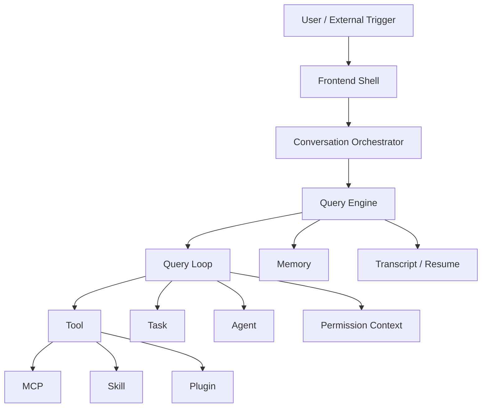

# Agent Runtime 术语表

> 返回入口：[[记忆库/语义记忆/claude-code-sourcemap-main/README|README]]
>
> 关联文档：
> - [[Claude Code 架构全景与时序分析]]
> - [[业务需求到 Agent Runtime 的转译手册]]
> - [[Agent 设计模板与范式]]
> - [[给 AI 的标准总提示词]]
> - [[Agent Runtime 实施路线图]]

## 文档定位

这份文档是这套知识库的 `Runtime Canon`。  
目的不是解释某个具体项目，而是统一之后所有 AI、设计者、工程师在讨论 Agent Runtime 时使用的核心术语、边界和关系。

如果未来要让 AI 根据业务需求快速构建 agent，这份文档必须被当作“抽象词典”优先输入。

建议与以下文档配合阅读：

- `Claude Code 架构全景与时序分析.md`
- `业务需求到 Agent Runtime 的转译手册.md`
- `Agent 设计模板与范式.md`

---

## 1. 总原则

本术语表默认采用以下设计哲学：

1. `Task-first`
   - agent 系统优先围绕任务、执行、恢复、权限来设计，而不是围绕聊天来设计。

2. `Runtime-first`
   - prompt 只是运行时的一部分，不能替代状态、工具、任务、权限和恢复机制。

3. `Unified capability plane`
   - 内建工具、业务工具、MCP、skills、plugins 最终都应收敛到统一能力平面。

4. `Explicit boundaries`
   - 每个抽象都必须有清晰边界，避免一个概念同时承担 UI、运行时、权限、调度多个职责。

---

## 2. 核心对象总图

---

## 3. 核心术语

### 3.1 Frontend Shell

#### 定义

面向用户的交互壳。可以是：

- Terminal UI
- IDE Extension
- Web UI
- API SDK

#### 职责

- 接受用户输入
- 展示消息与进度
- 展示权限请求
- 展示任务状态

#### 不应承担的职责

- 不直接实现 query loop
- 不直接调度工具
- 不直接维护 agent 生命周期

#### 判断标准

如果一个模块主要服务于“用户如何看见和操作系统”，它属于 Frontend Shell。

---

### 3.2 Conversation Orchestrator

#### 定义

连接前端与 runtime 的会话编排层。

#### 职责

- 接收输入事件
- 组织一次 turn 的提交
- 连接前端状态与 runtime 事件流
- 路由对话、命令、系统事件

#### 与 Query Engine 的区别

- Orchestrator 更偏“系统入口与交互编排”
- Query Engine 更偏“会话状态与运行时执行”

#### 判断标准

如果一个模块在“用户输入”和“runtime 执行”之间做调度与路由，它属于 Conversation Orchestrator。

---

### 3.3 Query Engine

#### 定义

会话级运行时对象，负责维护 conversation-scoped state，并为每次用户提交准备执行上下文。

#### 典型职责

- 维护消息历史
- 构建 system/user context
- 管理 transcript
- 管理 usage / cache / side effects
- 调用 Query Loop

#### 不等于

- 不等于单次模型调用封装器
- 不等于前端 state store
- 不等于单轮 tool executor

#### 判断标准

如果一个对象跨多个 turn 持有同一会话的状态，它属于 Query Engine。

---

### 3.4 Query Loop

#### 定义

单次用户请求对应的 agentic 执行循环。

#### 典型步骤

1. 组装输入
2. 发起模型请求
3. 接收流式输出
4. 发现工具调用
5. 执行工具
6. 回灌结果
7. 继续下一轮或终止

#### 关键性质

- 是一个循环，不是一次调用
- 是一个事件流，不是一个最终返回值
- 需要处理 token budget、fallback、stop hooks、compaction 等问题

#### 判断标准

如果一个模块定义了“模型和工具如何交替推进一次 agentic turn”，它属于 Query Loop。

---

### 3.5 Tool

#### 定义

模型可调用的能力单元。

#### 典型特征

- 有名称
- 有输入 schema
- 有输出 schema
- 有副作用语义
- 有权限约束

#### 常见类型

- 文件系统工具
- Shell / Execution 工具
- 搜索与检索工具
- 网络工具
- Agent Spawn Tool
- MCP Tool

#### 与 Command 的区别

- Tool 面向模型
- Command 面向用户

#### 判断标准

如果一个能力需要由模型直接决策是否调用，它应建模为 Tool。

---

### 3.6 Command

#### 定义

由用户显式触发的命令式入口，通常具有明确意图与参数格式。

#### 常见形式

- slash commands
- CLI subcommands
- menu actions

#### 与 Tool 的区别

- Command 是 user-facing API
- Tool 是 model-facing API

#### 判断标准

如果一个入口由用户明确输入或点击触发，而不是由模型推理选择，它更适合建模为 Command。

---

### 3.7 Task

#### 定义

带生命周期、状态、输出和恢复语义的执行单元。

#### 应包含的语义

- id
- type
- status
- start / end time
- output location
- progress
- notification
- resume / recovery metadata

#### 什么时候要建模成 Task

- 运行时间长
- 需要显示进度
- 可能被取消 / 恢复
- 结果要回流到对话
- 有后台执行需求

#### 判断标准

如果某个执行过程不是“即时返回一次结果”，而是需要生命周期管理，就应建模为 Task。

---

### 3.8 Agent

#### 定义

具备独立目标、上下文边界、工具边界、执行身份的运行时执行者。

#### Agent 至少应有

- role / purpose
- input
- output
- tool boundary
- permission policy
- memory policy
- failure policy

#### 不应把 Agent 理解成

- 一段 system prompt
- 一个模型别名
- 一个函数调用

#### 判断标准

如果某个执行者需要独立理解任务、自主选择工具、维持局部上下文，它属于 Agent。

---

### 3.9 Main Agent

#### 定义

与用户直接交互、负责综合与主流程推进的 agent。

#### 典型职责

- 理解用户意图
- 发起子任务
- 综合结果
- 与用户沟通

#### 不应做的事情

- 所有执行都自己做完
- 把所有细节混进同一上下文

---

### 3.10 Worker Agent

#### 定义

由主 agent 或 coordinator 派发的执行者，用于研究、实现、验证、后台运行等任务。

#### 典型特征

- 自主执行
- 上下文相对局部
- 产出结果或通知
- 往往不直接面向用户

---

### 3.11 Coordinator

#### 定义

专门负责拆解、派发、综合与纠偏的 agent 角色。

#### 职责

- 任务拆解
- 并行发起 worker
- 接收 worker 结果
- 决定继续、停止、重试、综合

#### 不应承担

- 过多直接执行
- 无限制自发分叉

---

### 3.12 Tool Permission Context

#### 定义

当前会话或当前 agent 的工具权限边界对象。

#### 典型内容

- 允许工具
- 禁止工具
- 额外工作目录
- 当前 permission mode
- 动态审批状态

#### 为什么重要

它不是 UI 提示，而是 runtime 真正的边界层。

---

### 3.13 Permission Mode

#### 定义

某个会话或 agent 当前的权限模式，例如：

- default
- plan
- auto
- restricted

#### 作用

- 决定哪些工具默认放行
- 决定哪些操作需要审批
- 决定某些高风险权限是否被剥离

---

### 3.14 Policy

#### 定义

比单次权限更高层的治理规则。

#### 典型来源

- 用户设置
- 项目设置
- 组织策略
- 托管配置

#### 与 Permission 的区别

- Permission 更偏运行时边界
- Policy 更偏规则来源与约束来源

---

### 3.15 Isolation

#### 定义

把 agent 放在独立执行环境中运行的机制。

#### 常见形式

- 独立 cwd
- worktree
- sandbox
- remote execution

#### 什么时候需要

- 避免污染主工作区
- 限制副作用
- 远程长任务
- 高风险自动执行

---

### 3.16 Background Execution

#### 定义

agent 或 task 不阻塞主对话线程，异步运行，并通过通知或状态流回传结果。

#### 典型特征

- 有 task id
- 有 output / progress
- 可查看状态
- 完成后通知主对话

---

### 3.17 Remote Agent

#### 定义

运行在远程环境中的 agent/task，而不是当前本地进程里直接执行。

#### 适用场景

- 长任务
- 远程审查
- 高隔离需求
- 云端执行

---

### 3.18 In-Process Teammate

#### 定义

运行在同一进程中，但拥有独立身份与局部上下文边界的 agent。

#### 风险与价值

- 优点：低延迟、共享资源快
- 风险：边界必须靠上下文和 runtime 严格维持

---

### 3.19 Transcript

#### 定义

会话执行过程的持久化记录。

#### 常包含

- user messages
- assistant messages
- tool use/result
- progress
- boundaries / compact markers

#### 为什么重要

- 恢复
- 调试
- 复盘
- 审计

---

### 3.20 Sidechain Transcript

#### 定义

脱离主消息流之外的附加记录链，用于保存某些 agent、task、tool 的独立执行轨迹。

#### 适用场景

- 子 agent transcript
- 大量工具结果
- 恢复后台任务

---

### 3.21 Resume

#### 定义

基于 transcript、task metadata、side outputs 恢复中断会话或任务的能力。

#### 不是

- 不只是“重新读取聊天记录”
- 不只是“从头再跑一次”

#### 真正要求

- 正确恢复状态
- 正确恢复运行边界
- 正确恢复任务与输出关联

---

### 3.22 Memory

#### 定义

超出当前 prompt window 之外的可利用知识层。

#### 可进一步拆分

- session memory
- project memory
- user memory
- long-term memory
- retrieval index

#### 与 Transcript 的区别

- Transcript 是执行记录
- Memory 是被 runtime 用于推理与决策的知识

---

### 3.23 Skill

#### 定义

一种轻量、结构化、可复用的能力封装，通常由 markdown/frontmatter 等声明式内容构成。

#### 常见用途

- 工作流模板
- 领域知识提示
- 工具范围约束
- 执行上下文约束

#### 与 Agent 的区别

- Agent 是执行者
- Skill 是能力包 / 策略包 / playbook

---

### 3.24 Plugin

#### 定义

较重型的扩展机制，可提供命令、技能、工具、配置或集成能力。

#### 常见特点

- 可安装/卸载
- 有命名空间
- 可包含多种能力入口

---

### 3.25 MCP

#### 定义

把外部系统能力和资源以标准协议接入 agent runtime 的扩展面。

#### 典型提供物

- tools
- resources
- prompts

#### 在 runtime 里的角色

它应被视为统一 capability plane 的一部分，而不是外挂。

---

### 3.26 Capability Plane

#### 定义

系统中所有模型可利用能力的统一平面。

#### 包含

- built-in tools
- MCP tools
- skill-triggered abilities
- plugin-provided capabilities

#### 设计要求

- 统一 schema
- 统一权限
- 统一观测
- 统一可发现性

---

### 3.27 Runtime Event

#### 定义

运行时发生的可观察事件。

#### 例子

- query started
- tool queued
- tool progress
- tool completed
- task spawned
- task completed
- permission denied

#### 用途

- UI 更新
- audit
- telemetry
- debugging
- resume

---

### 3.28 Runtime Control Plane

#### 定义

系统当前运行状态、配置与副作用联动的中心。

#### 常见实现

- AppState
- event bus
- shared store

#### 职责

- 聚合状态
- 驱动副作用
- 同步前端与执行状态

---

## 4. 容易混淆的概念对照表

| 概念 A | 概念 B | 核心区别 |
|---|---|---|
| Tool | Command | Tool 面向模型，Command 面向用户 |
| Agent | Skill | Agent 是执行者，Skill 是能力包 |
| Query Engine | Query Loop | 前者是会话级对象，后者是单轮执行循环 |
| Task | Tool Call | Task 有生命周期，Tool Call 是一次能力调用 |
| Transcript | Memory | Transcript 是记录，Memory 是可用于决策的知识 |
| Permission | Policy | Permission 是当前边界，Policy 是约束来源 |
| Background Task | Remote Task | 后台强调异步，远程强调执行环境 |

---

## 5. 需求映射速查规则

### 5.1 什么应该建模为 Tool

如果满足以下大多数条件，优先建模为 Tool：

- 粒度较小
- 输入输出清晰
- 由模型自主决定是否调用
- 不需要长生命周期

### 5.2 什么应该建模为 Task

如果满足以下条件，优先建模为 Task：

- 需要显示进度
- 可能耗时较长
- 需要恢复
- 可能在后台继续运行

### 5.3 什么应该建模为 Agent

如果满足以下条件，优先建模为 Agent：

- 需要独立目标
- 需要自己推理下一步
- 需要局部上下文边界
- 需要自主选择工具

### 5.4 什么应该建模为 Skill

如果满足以下条件，优先建模为 Skill：

- 高复用
- 可声明式描述
- 更像能力或 playbook，而不是执行实体

### 5.5 什么应该建模为 Plugin

如果满足以下条件，优先建模为 Plugin：

- 要作为可安装扩展分发
- 要提供多类能力
- 要有命名空间与独立配置

---

## 6. 给未来 AI 的最低使用要求

以后任何 AI 在使用这套知识库时，至少必须遵守以下要求：

1. 不得把 Agent 直接等同于 Prompt。
2. 不得把 Tool 直接等同于任意函数。
3. 不得忽略 Task 的生命周期管理。
4. 不得忽略 Permission Context。
5. 不得在没有 Resume 语义时宣称系统支持长流程 agent。
6. 设计时必须明确区分：
   - 前端壳
   - 会话引擎
   - 执行循环
   - 能力平面
   - 任务系统
   - 权限系统

---

## 7. 一句话版本

> 这套术语表的作用，是让所有后续 AI 都用同一套 runtime 语言理解你的业务需求，并把需求稳定映射成 Tool、Task、Agent、Skill、Plugin、Permission、Resume 这些可实现的系统对象。

---

## 文档导航

- 返回目录：[[记忆库/语义记忆/claude-code-sourcemap-main/README|README]]
- 查看参考样本：[[Claude Code 架构全景与时序分析]]
- 进入需求转译：[[业务需求到 Agent Runtime 的转译手册]]
- 进入模板库：[[Agent 设计模板与范式]]
- 进入 AI 直接使用入口：[[给 AI 的标准总提示词]]
- 进入工程落地路线：[[Agent Runtime 实施路线图]]
