# Claude Code 架构全景与时序分析

> 返回入口：[[记忆库/语义记忆/claude-code-sourcemap-main/README|README]]
>
> 配套文档：
> - [[Agent Runtime 术语表]]
> - [[业务需求到 Agent Runtime 的转译手册]]
> - [[Agent 设计模板与范式]]
> - [[给 AI 的标准总提示词]]
> - [[Agent Runtime 实施路线图]]

## 文档定位

这份文档的目标不是介绍“怎么使用 Claude Code”，而是帮助已经理解 LLM / Agent / Tool Calling / IDE Runtime 的读者，从系统架构角度完整理解 `claude-code-sourcemap-main` 里还原出来的 Claude Code 运行机制，并据此抽象出可迁移的产品设计原则。

这是一份：

- `Reference`：说明代码组织、模块职责、调用关系、核心抽象。
- `Explanation`：解释为什么 Claude Code 要这样设计，它解决了什么工程问题。

## 知识库目录结构图

这份文档现在位于 `01-源码理解`，它在整套知识库里的位置是“源码研究母文档”。  
也就是说，后续的术语、设计、实施、评审，大多都应该回到这里校正“Claude Code 原型到底是什么”。

```text
claude-code-sourcemap-main/
├── README.md
├── 00-入口/
│   ├── 内容地图 MOC.md
│   ├── 业务需求输入模板.md
│   ├── Master Prompt｜Agent Runtime Architect.md
│   └── 最短使用说明.md
├── 01-源码理解/
│   ├── Claude Code 架构全景与时序分析.md   ← 当前文档
│   ├── Agent Runtime 术语表.md
│   └── Prompt ／ Policy ／ Tool 三层边界说明.md
├── 02-设计方法/
│   ├── 业务需求到 Agent Runtime 的转译手册.md
│   ├── Agent 设计模板与范式.md
│   ├── 业务场景 Agent 蓝图库.md
│   └── 业务域专用 Tool 模板库.md
├── 03-实施使用/
│   ├── 给 AI 的标准总提示词.md
│   └── Agent Runtime 实施路线图.md
└── 04-评审治理/
    └── Agent 评审清单.md
```

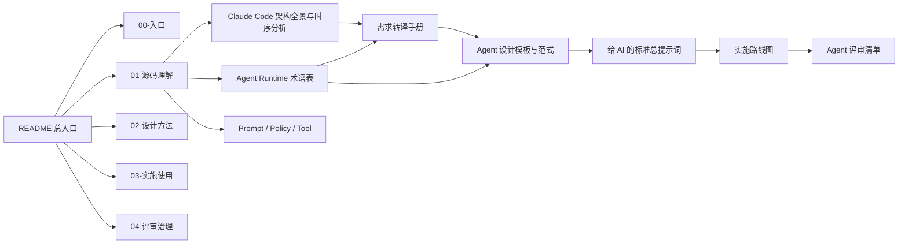

如果你是第一次读整套知识库，建议顺序是：

1. 先读当前文档，建立 Claude Code 的真实 runtime 心智模型。
2. 再读 [[Agent Runtime 术语表]]，把抽象语言固定下来。
3. 再进入需求转译、设计模板和实施路线。

## 先说结论

Claude Code 本质上不是“一个调用模型的 CLI”，而是一个完整的 `Agent Runtime`。  
它把以下能力统一到一个终端产品里：

- 会话管理
- Query 主循环
- 工具编排与执行
- 权限治理
- 多 Agent / 多任务协调
- MCP 接入
- Skills / Plugins 扩展
- 本地 / 远程 / 隔离工作树执行
- 会话恢复与 sidechain transcript
- 终端 UI 与交互态管理

如果把 Claude Code 当成产品来拆，它更接近：

- 一个 `Terminal-native agent operating system`
- 一个 `LLM-first task runtime`
- 一个 `以工具/任务为中心，而不是以聊天为中心` 的 Coding Agent 框架

---

## 1. 仓库本身是什么

这个仓库分为两层：

### 1.1 外层仓库：研究与还原层

作用是从 npm 包的 source map 中恢复源码。

- `package/`
  - npm 发布包内容
  - 关键文件是 `cli.js` 和 `cli.js.map`
- `extract-sources.js`
  - 读取 `cli.js.map`
  - 从 `sourcesContent` 中提取还原文件
  - 输出到 `restored-src/`

### 1.2 内层仓库：还原后的 Claude Code 主体

真正值得研究的是：

- `restored-src/src/`

README 也明确写了，这不是官方原始 monorepo，而是发布产物逆向恢复出的源码视图。因此它适合研究：

- Runtime 结构
- 模块职责
- 调用关系
- 设计模式

但不适合假设：

- 官方原始目录结构完全如此
- 测试、内部构建链、内部服务定义已完全暴露

---

## 2. 目录结构与系统形态

`restored-src/src` 的核心目录大致如下：

- `tools/`：模型可调用能力
- `commands/`：slash commands 与 CLI commands
- `services/`：MCP、API、压缩、提示建议、策略等中枢服务
- `utils/`：大量基础设施与运行时辅助逻辑
- `tasks/`：任务抽象与不同 agent 后端
- `state/`：全局状态定义与变更传播
- `screens/`：终端 UI 页面
- `components/`：Ink/React 组件
- `skills/`：技能加载与构建
- `plugins/`：插件系统
- `coordinator/`：多 agent 协调模式
- `remote/`：远程会话与远程执行

从文件量看，重量级目录非常明显：

- `utils`: 564 个 TS/TSX 文件
- `components`: 389 个 TS/TSX 文件
- `commands`: 189 个 TS/TSX 文件
- `tools`: 184 个 TS/TSX 文件
- `services`: 130 个 TS/TSX 文件

这说明 Claude Code 的复杂度主要不在“模型 prompt”，而在：

- runtime 基础设施
- 终端交互层
- 工具与扩展治理

---

## 3. 总体分层架构图

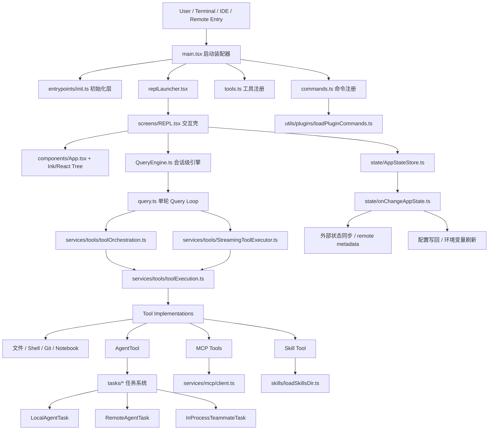

### 3.1 这一架构的本质

可以把它理解成五层：

1. `Bootstrap Layer`
   - 启动、初始化、配置、预取、模式选择
2. `Interaction Layer`
   - REPL、PromptInput、消息流、权限弹框、终端 UI
3. `Conversation / Query Layer`
   - 会话状态、单轮 agentic loop、压缩、重试、停止逻辑
4. `Execution Layer`
   - 工具执行、任务执行、子 agent 执行
5. `Extension & Governance Layer`
   - MCP、Skills、Plugins、Permissions、Settings、Telemetry

这个分层很重要，因为 Claude Code 的核心不是 UI，也不是模型 API，而是第 3 到第 5 层组成的 runtime。

---

## 4. 启动架构：`main.tsx` 为什么这么大

`main.tsx` 是整个系统的总装配器，不是“单纯入口文件”。

它承担的职责包括：

- 提前做启动性能优化
  - `startMdmRawRead()`
  - `startKeychainPrefetch()`
- 初始化核心环境
  - `init()`
- 注册命令系统
  - `getCommands()`
- 注册工具系统
  - `getTools()`
- 加载策略与远程托管设置
  - `loadPolicyLimits()`
  - `loadRemoteManagedSettings()`
- 加载 MCP / skills / plugins
- 处理会话恢复、resume、teleport、remote
- 启动 REPL 或 print/headless 模式

### 4.1 启动层架构图

```mermaid
flowchart LR
    A[Process Start] --> B[main.tsx]
    B --> C[启动预取]
    B --> D[解析 CLI Flags]
    B --> E[加载 Settings / Policy / Remote Managed Settings]
    B --> F[init()]
    B --> G[组装 Commands]
    B --> H[组装 Tools]
    B --> I[加载 Agent Definitions]
    B --> J[建立 AppState]
    B --> K[launchRepl / headless print / remote mode]
```

### 4.2 为什么这里集中装配

Claude Code 是一个“多模式产品”：

- 交互 REPL 模式
- 非交互 print/headless 模式
- remote / bridge 模式
- assistant / coordinator / proactive 等 feature-gated 模式

如果没有一个非常强的装配层，后面所有模块都会自行读环境、拼配置、推断模式，系统会失控。  
所以 `main.tsx` 不是臭，而是承担了 runtime composition root 的角色。

---

## 5. 交互层：REPL 不是壳子，而是操作系统前台

`replLauncher.tsx` 只做轻量加载，真正核心在：

- `components/App.tsx`
- `screens/REPL.tsx`

`App.tsx` 提供：

- AppStateProvider
- StatsProvider
- FpsMetricsProvider

`REPL.tsx` 则是超大型终端交互控制器，负责：

- 输入框状态
- 消息列表渲染
- 队列处理
- 对话提交
- 工具确认
- 权限请求
- 任务导航
- 子 agent transcript viewing
- 远程会话
- IDE 桥接
- 背景任务 UI

### 5.1 REPL 层架构图

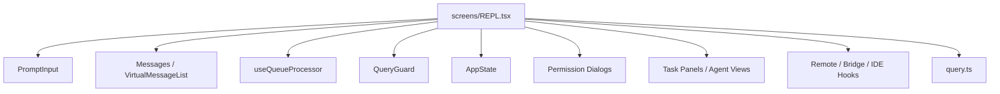

### 5.2 关键设计

Claude Code 的 UI 并不直接“驱动模型”，而是驱动一个更底层的 query runtime。  
这意味着：

- UI 可以换
- headless 可以复用同一套 query 核心
- remote 模式可以共享底层机制

这是非常成熟的产品设计，不是 demo 级 agent。

---

## 6. Query Engine：会话级引擎

`QueryEngine.ts` 是“会话级状态机”。

它负责：

- 持有当前 conversation 的 `mutableMessages`
- 构建 `ProcessUserInputContext`
- 获取系统 prompt 与上下文
- 处理 transcript 持久化
- 调用 `query()` 执行单次 turn
- 跨 turn 保留状态
  - 文件缓存
  - 权限拒绝记录
  - usage 统计
  - message store

### 6.1 QueryEngine 架构图

```mermaid
flowchart LR
    IN[submitMessage] --> CTX[构建 system/user context]
    CTX --> PUI[processUserInputContext]
    PUI --> Q[调用 query()]
    Q --> OUT[持续接收 SDKMessage / Message]
    OUT --> TR[recordTranscript / flushSessionStorage]
    TR --> STATE[更新 mutableMessages / usage / cache]
```

### 6.2 为什么需要 QueryEngine

很多 agent 系统把一次用户输入直接等价成一次模型调用。  
Claude Code 没这么做，它区分：

- `Conversation lifecycle`
- `Turn lifecycle`

这是高级系统和简化脚手架的根本区别。

QueryEngine 让它能支持：

- 会话恢复
- 多轮持续上下文
- transcript side effects
- headless / REPL 复用

---

## 7. Query Loop：Claude Code 真正的 Agentic Core

最关键的文件之一是 `query.ts`。

这里有一个明确的 `while (true)` 循环，它不是 bug，而是 agentic turn loop：

- 发起模型请求
- 接收 streaming response
- 发现 tool_use
- 执行工具
- 把 tool_result 回灌到消息流
- 必要时 compact / snip / reactive compact
- 继续下一轮
- 直到停止条件满足

### 7.1 Query 主循环时序图

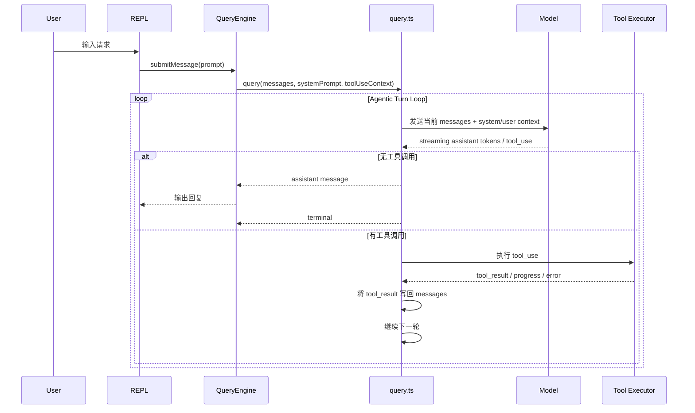

### 7.2 这里解决了哪些真实问题

#### 问题一：上下文无限增长

Claude Code 不是简单截断消息，而是实现了：

- auto compact
- microcompact
- history snip
- reactive compact
- tool result budget

这说明它已经遇到了生产中的真实痛点：

- 长会话成本高
- prompt cache 不稳定
- 工具输出污染上下文
- 大文件/大 diff 造成窗口爆炸

#### 问题二：工具调用不是同步块，而是流式事件

它有两套工具执行机制：

- `runTools()`：批执行
- `StreamingToolExecutor`：边 stream 边执行

后者的存在很能说明问题：Claude Code 不只是“拿到完整 response 后再跑工具”，而是支持更低延迟的 runtime。

#### 问题三：停止条件和 hook 并不简单

这里还有：

- stop hooks
- post-sampling hooks
- fallback / retry
- token budget continuation

也就是说，这个 query loop 实际上是一个受多种 side effect 影响的调度器，而不是一个纯聊天轮次。

---

## 8. 工具系统：模型可见能力的统一接口层

`tools.ts` 是工具注册中心。

它把各种工具统一为模型可见能力，包括：

- 文件读写
- Shell / Bash / PowerShell
- Grep / Glob
- Web Fetch / Web Search
- Notebook 编辑
- Skill Tool
- Agent Tool
- MCP Resource 读取
- Plan / Worktree / Task 相关工具

### 8.1 工具系统架构图

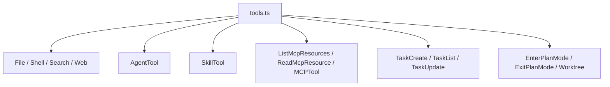

### 8.2 工具系统的关键价值

Claude Code 的设计非常清楚：

- 工具是能力边界
- 权限系统围绕工具生效
- 子 agent 也是通过工具触发
- MCP 扩展最终也映射成工具

这是一种非常强的统一抽象。  
你做下一代 agent 产品时，最好也把一切外部能力收敛到统一的 tool contract，而不是散落在 prompt、router、plugin manager、UI action 中。

---

## 9. Tool Execution：并发安全与流式执行

`toolOrchestration.ts` 和 `StreamingToolExecutor.ts` 非常值得研究。

### 9.1 `toolOrchestration.ts`

它做的不是“遍历调用”，而是：

- 判断工具是否 `isConcurrencySafe`
- 将工具调用分批
  - 只读安全工具可并发
  - 写操作或不安全工具串行
- 按顺序回放结果和上下文修改

### 9.2 `StreamingToolExecutor.ts`

这个类说明 Claude Code 已经进入了更高阶的 runtime 设计：

- 工具可以在 stream 过程中启动
- 并发安全工具可并发运行
- 非并发安全工具必须独占
- 支持 sibling error cancellation
- 支持 streaming fallback discard
- 支持 progress message 立即产出

### 9.3 Tool Execution 时序图

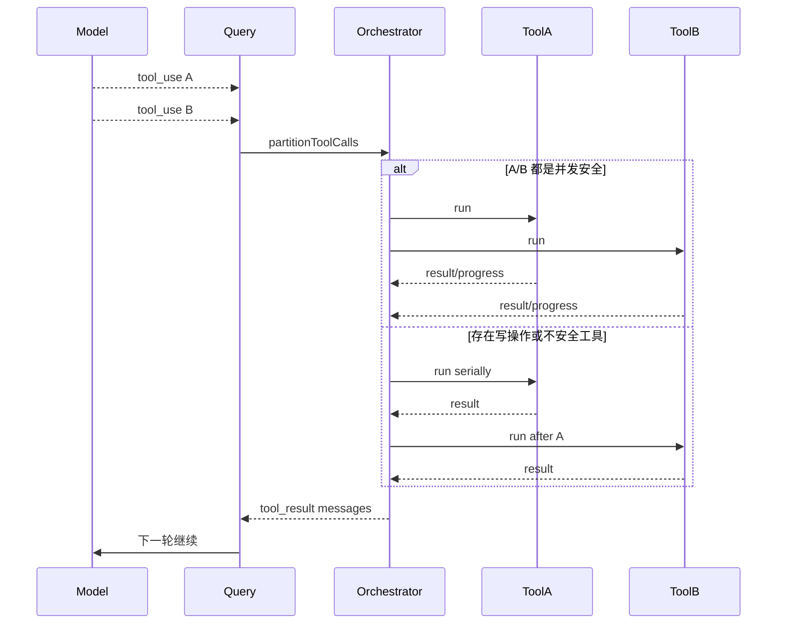

### 9.4 这部分背后的哲学

Claude Code 并没有把工具系统当成“函数调用插件”，而是当成：

- 带状态的
- 带副作用的
- 需要调度的
- 需要治理的

执行图谱。

这是成熟 agent runtime 的标志。

---

## 10. Agent 系统：Claude Code 最核心的抽象之一

`AgentTool.tsx` 是整个多 agent 体系的统一入口。

它允许模型触发新的 agent，并选择：

- `run_in_background`
- `isolation`
  - `worktree`
  - `remote`
- `cwd`
- `subagent_type`
- `name`
- `team_name`
- `mode`

### 10.1 Agent 系统架构图

```mermaid
flowchart TB
    AgentTool[AgentTool.call]
    AgentTool --> Select[选择 agent definition]
    Select --> Decision{执行后端}
    Decision --> Sync[同步本地 subagent]
    Decision --> Async[本地后台 local_agent]
    Decision --> Remote[remote_agent]
    Decision --> Team[teammate / in-process teammate]
    Sync --> RunAgent[runAgent()]
    Async --> LocalTask[registerAsyncAgent]
    Remote --> RemoteTask[registerRemoteAgentTask]
    Team --> SpawnTeam[spawnTeammate / spawnInProcessTeammate]
```

### 10.2 Claude Code 里的三类 agent

#### A. `local_agent`

本地 agent，通常作为后台或前台子代理执行。

特点：

- 有 task id
- 有独立 transcript
- 有进度统计
- 有 output file
- 可恢复、可通知、可继续

#### B. `remote_agent`

远程执行的 agent，运行在 Claude Remote / CCR 一类环境。

特点：

- 适合长任务
- 适合隔离环境
- 适合远程 review / ultraplan / background task
- 通过 session log 回收结果

#### C. `in_process_teammate`

同进程 agent，通过 `AsyncLocalStorage` 与 teammate context 隔离。

特点：

- 同一 Node.js 进程内运行
- 有 team-aware identity
- 支持 plan mode approval
- 生命周期纳入 AppState.tasks

### 10.3 为什么这很重要

多数 agent 产品的“多 agent”本质上只是：

- 多个模型调用
- 一个调度 prompt

Claude Code 不一样。  
它把 agent 设计成：

- 可执行实体
- 可持久化实体
- 可恢复实体
- 可治理实体

也就是 runtime entity，而不是 prompt macro。

---

## 11. Task 系统：多 agent 的真正骨架

`Task.ts` 定义了系统中的统一任务抽象。

任务类型包括：

- `local_bash`
- `local_agent`
- `remote_agent`
- `in_process_teammate`
- `local_workflow`
- `monitor_mcp`
- `dream`

### 11.1 Task 架构图

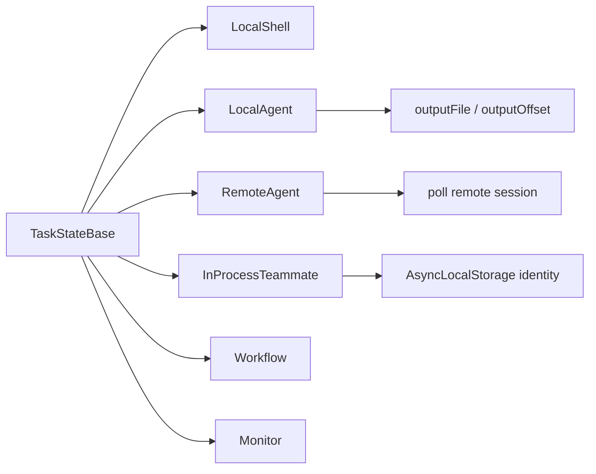

### 11.2 为什么任务系统是核心

Claude Code 把很多本可“直接执行”的事情，都变成 task：

- bash
- 子 agent
- remote review
- in-process teammate

这样做的价值是：

- UI 可统一显示
- 生命周期可统一管理
- 恢复逻辑可统一处理
- 通知可统一发送
- 任务结果可统一进入消息队列

这是一个非常强的工程抽象，值得直接学习。

---

## 12. Coordinator Mode：中央编排，而非 agent 自发分叉

`coordinator/coordinatorMode.ts` 暴露了 Claude Code 的多 agent 哲学：

- 主体是 `coordinator`
- worker 负责研究、实现、验证
- worker 结果以 `<task-notification>` 的形式回流
- coordinator 负责综合、继续派发、停止错误方向任务

### 12.1 Coordinator 架构图

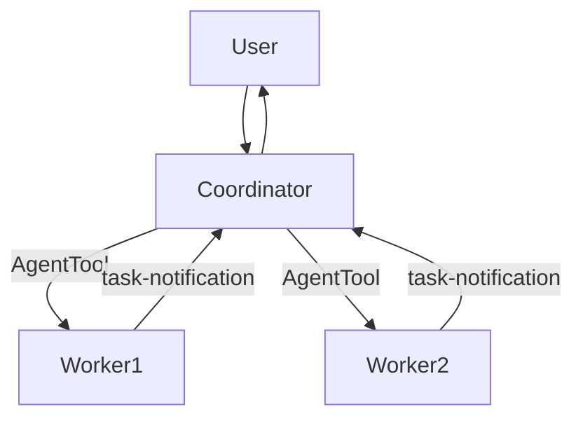

### 12.2 这种模式解决了什么

- 避免单个 agent 把所有任务混在一个上下文里
- 允许并行读、多点搜索、多路径验证
- 让“综合”与“执行”职责分离

这是典型的 `centralized orchestration, distributed execution`。

如果你做 coding agent，这通常比“让主 agent 自动无限分叉”更稳。

---

## 13. Agent Definitions：Agent 不是 prompt 片段，而是可配置实体

`tools/AgentTool/loadAgentsDir.ts` 定义了 agent 的加载机制。

agent 可以来自：

- built-in
- user settings
- project settings
- policy settings
- plugin

支持的配置包括：

- `tools`
- `disallowedTools`
- `model`
- `effort`
- `permissionMode`
- `mcpServers`
- `hooks`
- `maxTurns`
- `skills`
- `memory`
- `background`
- `isolation`

### 13.1 这说明什么

Claude Code 的 agent definition 已经接近“运行时角色配置文件”，而不仅是 system prompt 模板。

这也说明更成熟的 agent 系统应该把 role 定义提升为一等配置对象，而不是散落在 prompt registry 中。

---

## 14. MCP：扩展系统的一等公民

`services/mcp/client.ts` 是一个大型连接与能力映射中心。

它负责：

- 连接 MCP server
  - stdio
  - SSE
  - streamable HTTP
  - WebSocket
- 认证与 token 刷新
- 发现 tools / prompts / resources
- 工具包装
- 资源读取
- auth error 降级为需要重新授权

### 14.1 MCP 架构图

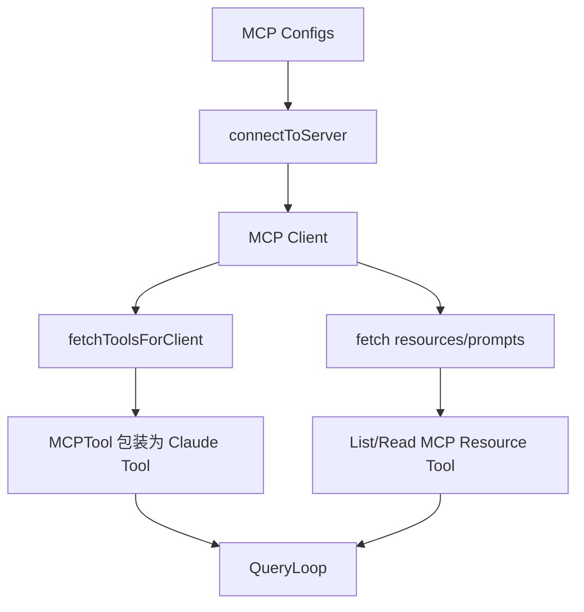

### 14.2 为什么说 MCP 是一级公民

因为在 Claude Code 里，MCP 不是插件外链，而是被完整纳入：

- 工具池
- 命令池
- 资源池
- 权限系统
- 预取系统
- 认证系统

这是一种真正的扩展内核设计。

---

## 15. Skills：Markdown 驱动的轻量能力封装

`skills/loadSkillsDir.ts` 展示了 Claude Code 的 skill system。

skill 的本质不是“prompt snippet”，而是带 frontmatter 的能力单元，支持：

- 描述
- `when_to_use`
- `allowed-tools`
- `model`
- `effort`
- `hooks`
- `agent`
- `shell`
- `executionContext`

### 15.1 Skill 架构图

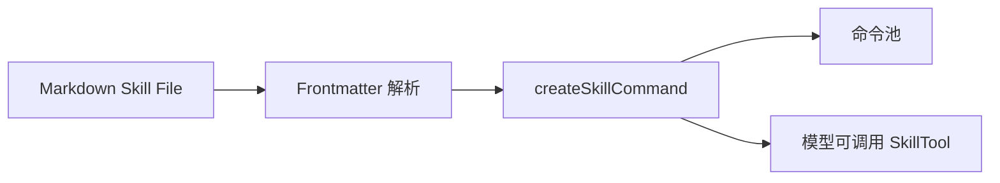

### 15.2 Skills 的产品意义

skills 是一种极低成本、极高可扩展性的 capability packaging 机制：

- 人类可写
- 模型可读
- 可绑定工具范围
- 可绑定执行上下文

对构建 agent 产品非常实用。  
它比“写死 prompt 模板”更结构化，比“完整插件”更轻。

---

## 16. Plugins：重型扩展层

`utils/plugins/loadPluginCommands.ts` 说明插件系统已经超出简单 command 注入：

- 遍历插件 markdown
- 支持 skill 目录
- 变量替换
- 用户配置注入
- 命名空间化命令
- 动态加载 commands / skills

### 16.1 Skills 与 Plugins 的区别

- `Skills`
  - 更轻
  - 更像内容包/能力包
- `Plugins`
  - 更重
  - 更像扩展模块与命令提供者

这两层同时存在，说明 Claude Code 在扩展系统上采用了分层策略，而不是单一插件模型。

---

## 17. Permission System：安全是 runtime 内生结构

`utils/permissions/permissionSetup.ts` 是安全治理核心之一。

它处理：

- permission mode
- dangerous tool pattern stripping
- auto mode 下的危险权限移除
- bash / powershell / agent tool 风险分析

### 17.1 权限架构图

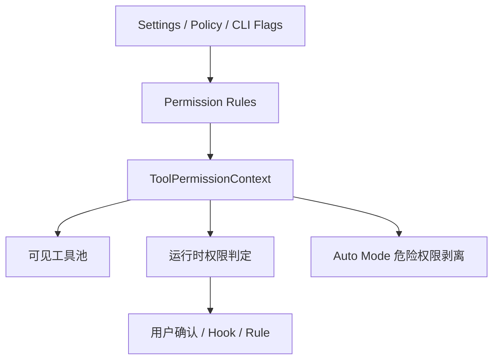

### 17.2 这部分最值得学习的点

Claude Code 没把安全做成“最后弹框”，而是三层同时治理：

- 模型看到哪些工具
- 运行时能不能真正调用
- auto mode 下哪些权限必须被剥离

这比很多 agent 框架安全得多。

尤其是它把以下都视为高风险：

- `Bash(*)`
- PowerShell 任意代码执行模式
- AgentTool 的自动放行

这说明它非常清楚 delegation attack 的风险。

---

## 18. State 系统：为什么要有 `AppState`

`state/AppStateStore.ts` 定义了一个很大的 `AppState`，其中最关键的是：

- `tasks`
- `toolPermissionContext`
- `mcp`
- `plugins`
- `agentDefinitions`
- `notifications`
- `todos`
- `viewingAgentTaskId`
- `foregroundedTaskId`

这不是简单 UI state，而是整个 runtime 的控制面。

### 18.1 状态变更传播

`state/onChangeAppState.ts` 是一个重要的统一 diff hook，负责：

- mode 变化时同步 external metadata
- mainLoopModel 写回 settings
- 环境变量重应用
- 全局 config 同步

### 18.2 状态层时序图

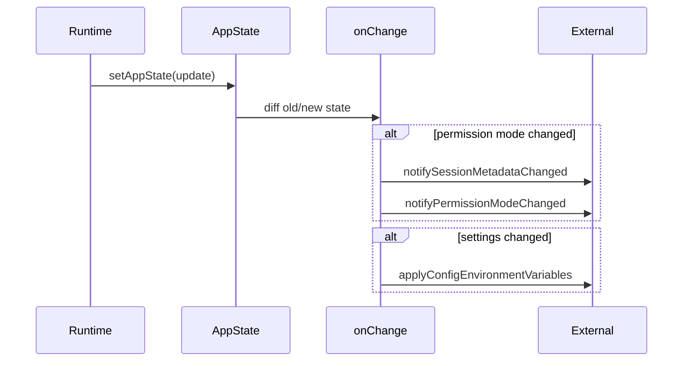

这说明 Claude Code 的状态设计不是“让组件渲染”，而是“把运行时事件映射到副作用”。

---

## 19. 会话恢复与 Sidechain Transcript

Claude Code 很重视会话恢复。

能看到大量相关实现：

- `recordTranscript`
- `flushSessionStorage`
- `getAgentTranscriptPath`
- `writeAgentMetadata`
- `restoreRemoteAgentTasks`
- `loadConversationForResume`

### 19.1 恢复机制为什么关键

对于 coding agent，真正高价值的任务通常都不是一次性问答，而是：

- 长时会话
- 多工具操作
- 中断恢复
- 后台任务完成后回流

如果没有 transcript、task metadata、output file、resume 机制，产品就只能停留在 demo。

Claude Code 在这方面已经是“生产级 runtime”。

---

## 20. 一条完整请求的总时序图

下面这张图可以把前面几个核心层串起来：

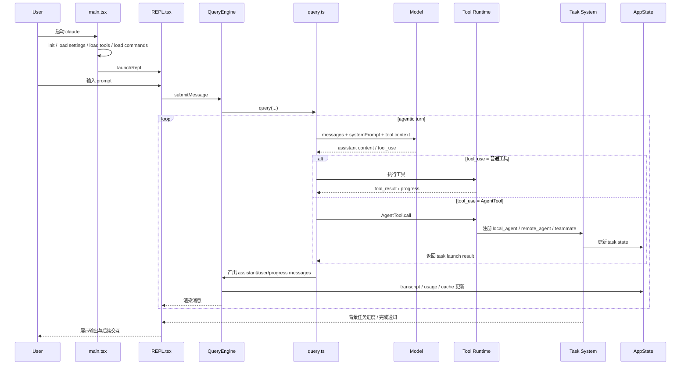

---

## 21. Claude Code 的设计哲学

### 21.1 它不是 chat-first，而是 task-first

很多产品把 agent 做成“会聊天且能调用工具”。  
Claude Code 更像“围绕任务、工具、状态和恢复构建的操作系统”。

### 21.2 它不是 prompt-first，而是 runtime-first

这里最复杂的部分不是 prompt，而是：

- QueryEngine
- query loop
- task system
- tool orchestration
- permission runtime
- state propagation

### 21.3 它不是 single-agent with hacks，而是 multi-runtime entity model

agent 在这里已经被提升为运行时实体：

- 有 identity
- 有 transcript
- 有 task state
- 有 output channel
- 有恢复语义
- 有隔离模式

这是 Claude Code 相对许多 Agent 框架更成熟的地方。

---

## 22. 你应该如何用这份项目启发自己的产品

如果你想在 OpenAI 生态里做更强的 coding agent，我建议优先吸收这五个抽象：

### 22.1 抽象一：`QueryEngine`

把“会话状态”和“单轮推理循环”分离。  
不要让 UI 或 API handler 直接编排工具和消息。

### 22.2 抽象二：`Task`

让所有长操作都成为可追踪、可恢复、可通知的任务。  
包括：

- 子 agent
- shell
- remote job
- workflow

### 22.3 抽象三：`ToolPermissionContext`

让权限成为一等 runtime 对象。  
不要只做 tool-call 前的弹窗确认。

### 22.4 抽象四：`AgentTool`

统一所有子 agent 触发入口，再由 runtime 决定：

- 同步 or 异步
- 本地 or 远程
- 同进程 or worktree

### 22.5 抽象五：`Extension Unification`

把：

- 内建工具
- MCP
- skills
- plugins

统一到同一个能力平面，而不是分散成四套系统。

---

## 23. 这份逆向源码的限制

理解时需要注意：

- 这是从 sourcemap 恢复的源码，不等于官方内部 monorepo
- 可能缺失测试、部分构建语义、内部服务定义
- feature flags 很多，有些路径只在内部 build 中启用
- 一些 `process.env.USER_TYPE === 'ant'` 的逻辑说明存在明显内部 / 外部差异

所以研究时应该重点关注：

- 抽象边界
- 调用关系
- 设计模式

而不是逐字认为所有功能都对外可用。

---

## 24. 最后一句话总结 Claude Code

Claude Code 可以被概括为：

> 一个以 Query Loop 为大脑、以 Tool System 为手、以 Task System 为骨架、以 Permission System 为边界、以 MCP/Skills/Plugins 为扩展面的终端 Agent Runtime。

如果只看表面，它像一个 AI CLI。  
如果看内部，它更像一个可编排、可治理、可恢复、可扩展的 Agent 操作平台。

---

## 附：推荐阅读路径

如果你想继续深入源码，建议按这个顺序：

1. `restored-src/src/main.tsx`
2. `restored-src/src/screens/REPL.tsx`
3. `restored-src/src/QueryEngine.ts`
4. `restored-src/src/query.ts`
5. `restored-src/src/tools.ts`
6. `restored-src/src/services/tools/toolOrchestration.ts`
7. `restored-src/src/services/tools/StreamingToolExecutor.ts`
8. `restored-src/src/tools/AgentTool/AgentTool.tsx`
9. `restored-src/src/tasks/*`
10. `restored-src/src/services/mcp/client.ts`
11. `restored-src/src/skills/loadSkillsDir.ts`
12. `restored-src/src/utils/permissions/permissionSetup.ts`
13. `restored-src/src/state/AppStateStore.ts`
14. `restored-src/src/state/onChangeAppState.ts`

按这个顺序，你会先建立主干，再理解复杂横切层，而不会在海量工具与组件里迷失。

---

## 25. 按源码文件逐段深读

这一章的目标不是重复目录结构，而是把最关键的入口文件拆成“阅读时应该关注什么”。  
你以后再带 AI 深读这套源码，可以直接按本章的顺序喂文件和问题。

### 25.1 `main.tsx`：系统总装配器

#### 你应该怎么读

不要试图从第一行顺序读到最后一行。  
`main.tsx` 很长，正确读法是按功能块拆：

1. 启动前置 side effects
2. CLI flag 与运行模式解析
3. 初始化与配置装载
4. tools / commands / agents 的装配
5. REPL 或 print/headless 的启动
6. resume / remote / bridge / teleport 等特殊路径

#### 重点观察点

- 为什么在顶层就有 `startMdmRawRead()` 和 `startKeychainPrefetch()`
  - 这是典型的 `startup critical path optimization`
- 为什么大量使用 `feature(...)` 和动态 `require`
  - 这是为了 dead code elimination 和内部/外部 build 分离
- 为什么 `getTools()`、`getCommands()`、`getAgentDefinitionsWithOverrides()` 都在这里会合
  - 因为这里是 composition root

#### 你应该向 AI 提的问题

- `main.tsx` 中哪些初始化必须在 trust established 之前执行，哪些必须在之后执行？
- 各种 mode 的分流条件分别是什么？
- tools / commands / agent definitions 的装配顺序为什么不能交换？
- 哪些逻辑是为了 cold start latency 优化？

#### 对产品迭代的启发

如果你做自己的 agent runtime，你也应该有一个非常清晰的 `composition root`。  
不要让 UI、query、plugins、permissions 各自偷偷初始化自己。

---

### 25.2 `screens/REPL.tsx`：前台交互控制中心

#### 你应该怎么读

按“用户交互闭环”读，不按 React hook 顺序读：

1. 输入如何进入系统
2. 消息如何渲染
3. query 如何发起
4. query 过程中 UI 如何维持一致性
5. background tasks / teammate transcript / dialogs 如何接入

#### REPL 真正负责的事情

- PromptInput
- 消息渲染与虚拟滚动
- queryGuard
- 队列消费
- 权限弹框
- sandbox / MCP elicitation
- 任务面板
- agent transcript viewing
- 本地命令与 slash commands 的交互渲染

#### 重点观察点

- `QueryGuard` 为什么存在
  - 用来把“是否有 query 在跑”从普通 React state 提升为更稳的并发控制器
- `useQueueProcessor()` 为什么关键
  - 因为输入、即时命令、排队命令、系统通知不是同一种消息
- 为什么 agent task 与主对话 transcript 是并存的
  - 因为 Claude Code 是 task-first，不是纯 chat-first

#### 建议深读方式

以这几个点为锚：

- `onSubmit`
- `onQueryImpl`
- `useQueueProcessor`
- `getToolUseContext`
- 与 `PromptInput`、`Messages`、`TaskListV2` 的连接点

#### 对产品迭代的启发

如果你以后要做 terminal agent、IDE agent 或 Web agent，不要让 UI 直接耦合 query 细节。  
UI 应该是 orchestration shell，不应该是 runtime core。

---

### 25.3 `QueryEngine.ts`：会话级生命周期管理器

#### 你应该怎么读

把它当成 `Conversation Runtime`，而不是“API 请求包装器”。

读的时候盯住三件事：

1. 它保存什么跨 turn 状态
2. 它在 submit 一个消息之前准备了什么
3. 它如何把 `query()` 的结果写回 transcript / storage / in-memory state

#### 核心职责

- 维护 `mutableMessages`
- 构造 `ProcessUserInputContext`
- 获取 system prompt parts
- 组织 user/system context
- 调用 `query()`
- 记录 transcript
- 管理 usage / permission denials / file cache

#### 关键设计判断

这里说明 Claude Code 已经把“对话”看成一个持续运行的会话对象。  
这意味着后续可以扩展：

- 多前端复用同一个会话引擎
- 远程会话镜像
- 长时上下文恢复

#### 你应该向 AI 提的问题

- `QueryEngine` 持有的 state 哪些是 turn-scoped，哪些是 conversation-scoped？
- 为什么 `processUserInputContext` 在一次 submit 中会被重建？
- transcript 为什么不是 query 末尾一次性写入，而是多次增量写入？

---

### 25.4 `query.ts`：Agentic Loop 核心

#### 这是最值得深读的文件之一

如果你只读一份文件来理解 Claude Code 的 agent runtime，优先级就是 `query.ts`。

#### 正确读法

按循环阶段读：

1. 输入 state 初始化
2. memory / skill prefetch
3. 发起 model request
4. 流式接收 messages / tool_use
5. 选择工具执行路径
6. 回灌 tool_result
7. stop hooks / compact / continuation
8. terminal return

#### 重点观察点

- 为什么 `query()` 返回的是 async generator
  - 因为 Claude Code 的输出不是一个最终值，而是一个持续事件流
- 为什么 loop 内有大量 compact / token budget / fallback 分支
  - 因为真实生产环境下，token、上下文长度、工具输出、失败重试都会影响 agent 行为
- 为什么 `toolUseContext` 在 loop 内会被不断重建
  - 因为 context 不是常量，会随着 query chain、tool progress、runtime 状态变化

#### 这份文件真正定义了什么

它定义了 Claude Code 的 `turn semantics`：

- 一轮对话不是一次 API 调用
- 一轮对话是一系列 `model -> tool -> model -> tool -> ...` 的状态转换

#### 对你做产品最重要的启发

你如果想做强 agent，不要写 `while tool_calls: run_tool()` 这种玩具循环。  
真正的 query loop 必须把以下看成一等问题：

- context growth
- cancellation
- mid-stream tool dispatch
- parallel-safe / serial-only tools
- persistent transcript
- budget continuation
- stop hooks

---

### 25.5 `tools.ts`：能力平面定义

#### 你应该怎么读

这不是“看有哪些工具”，而是“看系统怎么决定模型可见能力”。

#### 重点观察点

- `getAllBaseTools()` 是事实上的 tool universe
- `isEnabled()` / feature flags / permission filtering / mode filtering 共同决定实际 tool pool
- `AgentTool`、`SkillTool`、MCP 相关工具和文件工具处于同一级别

#### 深层含义

Claude Code 的一切“能做什么”都收敛到统一的 tool plane。  
这就是为什么：

- 多 agent 能自然接入
- MCP 能自然接入
- 权限系统能统一生效

---

### 25.6 `toolOrchestration.ts` + `StreamingToolExecutor.ts`：调度器而不是函数调用器

#### 你应该怎么读

重点不是看怎么执行单个工具，而是看：

- 工具之间如何调度
- 为什么要区分并发安全
- 为什么流式工具执行要维护状态机

#### 必须抓住的抽象

- `partitionToolCalls`
- `isConcurrencySafe`
- `TrackedTool`
- queued / executing / completed / yielded 状态
- sibling cancellation

#### 设计价值

这套机制是 Claude Code 从“tool-calling chat app”跃迁到“runtime”的关键标志之一。

---

### 25.7 `tools/AgentTool/AgentTool.tsx`：统一子代理入口

#### 这是多 agent 的中枢文件

这里最值得看的不是 prompt，而是决策树：

- 当前请求是同步 subagent、异步后台 agent、remote agent，还是 teammate？
- 是否 worktree 隔离？
- 是否 remote 隔离？
- 是否 background？
- 是否需要注册 task 和通知？

#### 正确读法

按这条链路读：

1. 输入 schema
2. agent selection
3. team / teammate path
4. remote path
5. background local path
6. sync local path
7. `runAgent()` 的调用方式

#### 对产品的启发

最成熟的做法不是定义多个“spawn_xxx_agent”接口，而是统一成一个 `AgentTool` 抽象，再由 runtime 做后端路由。

---

### 25.8 `tools/AgentTool/runAgent.ts`：单个子代理的执行包装器

#### 它的意义

`AgentTool` 负责决定“启动什么 agent”，`runAgent.ts` 负责真正把一个 agent 放进 query runtime 中运行。

#### 应重点看什么

- agent-specific MCP server 初始化
- agent-specific tool pool 解析
- 系统 prompt / user context 如何被增强
- transcript subdir 如何处理
- worktree/cwd override 如何注入

#### 深层结论

Claude Code 的 subagent 不是简单“继承主对话上下文然后换个 prompt”，而是：

- 有自己的执行环境
- 有自己的工具池
- 可以有自己的 MCP servers
- 可以有自己的 transcript

---

### 25.9 `tasks/*`：不同执行后端的统一抽象

#### 必读文件

- `Task.ts`
- `tasks/LocalAgentTask/LocalAgentTask.tsx`
- `tasks/RemoteAgentTask/RemoteAgentTask.tsx`
- `tasks/InProcessTeammateTask/InProcessTeammateTask.tsx`

#### 正确读法

比较读，而不是分别读。  
核心问题是：

- 三者共享什么
- 三者差异在哪里
- 哪些差异是 runtime 能力边界导致的

#### 你应该得到的理解

- `local_agent` 是异步本地 worker
- `remote_agent` 是远程 session poller
- `in_process_teammate` 是共享进程但隔离 identity 的 teammate

这三个 together 才是 Claude Code 多 agent 的完整语义。

---

### 25.10 `services/mcp/client.ts`：扩展连接内核

#### 正确读法

不要从协议细节入手，而要从 Claude Code 的运行目标入手：

- 外部能力如何被引入系统
- 如何映射成工具
- 如何纳入 auth / cache / retry / resource loading

#### 重点抓手

- `connectToServer`
- `fetchToolsForClient`
- `getMcpToolsCommandsAndResources`
- `prefetchAllMcpResources`

#### 关键认识

在 Claude Code 里，MCP 不是“第三方外设”，而是运行时的原生扩展面。

---

### 25.11 `skills/loadSkillsDir.ts`：轻量能力封装模型

#### 正确读法

把它看成一套“human-readable capability packaging system”。

#### 应重点理解

- Markdown + frontmatter 如何变成 command/skill
- tool allowlist 如何绑定在 skill 上
- execution context 如何约束运行方式
- MCP skill builders 如何注入

#### 产品启发

这套机制非常适合被移植到你自己的 agent 平台里，作为：

- 领域能力包
- 业务工作流 prompt/constraint 包
- 组织内可复用 agent playbook

---

### 25.12 `utils/permissions/permissionSetup.ts`：安全控制面

#### 正确读法

围绕一个问题看：  
Claude Code 如何保证 agent 不在错误的权限状态下自动越界？

#### 重点抓手

- dangerous bash permissions
- dangerous powershell permissions
- dangerous task permission
- auto mode stripping

#### 你最终应该得出的结论

权限不是工具调用前的一个 if，而是一套：

- 配置时约束
- 暴露时约束
- 运行时约束
- 模式切换时约束

---

### 25.13 `state/AppStateStore.ts` + `state/onChangeAppState.ts`：运行时控制面

#### 正确读法

先读 `AppStateStore.ts` 看“系统持有哪些状态”，再读 `onChangeAppState.ts` 看“哪些状态变化会触发副作用”。

#### 关键认识

Claude Code 的 state 不是 UI store，而是整个 runtime 的 shared control plane。

---

## 26. 面向 OpenAI / Codex 类产品的可复用 Runtime Blueprint

这一章不再讨论 Claude Code “是什么”，而是提炼出一版你可以直接拿来构建下一代 agent 产品的 runtime blueprint。

### 26.1 Blueprint 的目标

目标是构建一种产品内核，满足以下要求：

- 能支持 coding / workflow / research / ops 等 agent
- 能统一 terminal、IDE、web、API 四种前端
- 能支持同步 agent、异步 worker、远程 worker
- 能支持企业级安全与权限治理
- 能让 AI 在有完整上下文文档时快速生成新 agent

### 26.2 Blueprint 总图

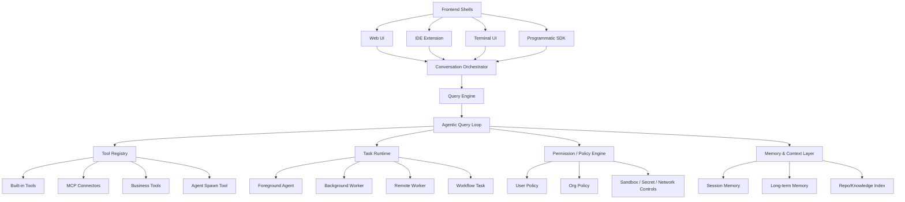

### 26.3 你应该保留的核心模块

#### 模块一：Frontend Shell

前端只是交互层，不应该持有 agent runtime 逻辑。

你可以有：

- Web app
- VS Code / Cursor / JetBrains extension
- Terminal client
- API SDK

但它们都应该只调用同一套 orchestrator/runtime。

#### 模块二：Conversation Orchestrator

职责：

- 接受输入
- 分发到 QueryEngine
- 连接 UI 事件流与 runtime 事件流

这层类似 Claude Code 里的 REPL + QueryEngine 组合，但你可以做得更清晰一些。

#### 模块三：Query Engine

职责：

- conversation-scoped state
- context assembly
- transcript management
- turn submission

#### 模块四：Agentic Query Loop

职责：

- model streaming
- tool dispatch
- retries / fallback
- context compaction
- stop conditions

#### 模块五：Tool Registry

职责：

- 统一工具 contract
- 动态裁剪模型可见工具
- 工具 schema / permission / cost metadata

#### 模块六：Task Runtime

职责：

- 管理 agent / workflow / remote job 生命周期
- task state
- notification
- resume

#### 模块七：Permission / Policy Engine

职责：

- session-level mode
- org-level policy
- dangerous tool stripping
- audit trail

#### 模块八：Memory & Context Layer

职责：

- 短期会话 memory
- repo index / retrieval
- 长期经验 memory
- context budget control

### 26.4 面向 OpenAI / Codex 的具体改进建议

Claude Code 非常强，但如果你是从 OpenAI / Codex agent 产品视角做下一代系统，我建议做以下升级：

#### 升级一：把 QueryEngine 与 UI 完全解耦成 SDK-first runtime

Claude Code 已经部分做到，但 REPL 仍然很重。  
你的新架构可以更彻底：

- Runtime 变成服务内核
- Terminal / IDE / Web 都是 adapter

#### 升级二：把 Task Runtime 做成事件总线驱动

Claude Code 目前大量依赖 AppState 和 message queue。  
下一代设计可以增加：

- typed event bus
- persistent event log
- task event sourcing

这样更适合多前端、多 worker、多 remote node。

#### 升级三：把 Agent Definition 升级成正式的 Agent Spec

建议一个 agent spec 至少包含：

- role
- objective
- allowed tools
- disallowed tools
- isolation policy
- cost budget
- context budget
- memory policy
- escalation rules
- verification contract

这会比当前 markdown frontmatter 更适合规模化。

#### 升级四：把 Skills 与 Business Playbooks 融合

Claude Code 的 skills 偏能力/工作流触发。  
你做业务产品时，可以演化成：

- domain playbooks
- SOP-backed agents
- business policy templates

例如：

- 销售跟进 agent
- 客诉分流 agent
- 财务核销 agent
- DevSecOps review agent

#### 升级五：把 Permission 系统前移到 Planning 阶段

Claude Code 已经在 execution 侧做得很好。  
你可以更进一步：

- 在 planning 阶段就显示将用到哪些工具、哪些数据源、哪些权限
- 对高风险 plan 做预审

这样对企业产品更友好。

---

## 27. 把这份文档变成未来 AI 快速构建 Agent 的母文档

你提的第三点最关键。  
你真正需要的不是“一份读完很爽的研究笔记”，而是一份以后可以丢给 AI，当作高质量上下文，让 AI 快速生成新 agent 的 `Operational Knowledge Base`。

这意味着文档必须从“解释型文档”升级为“构建型文档”。

### 27.1 未来给 AI 的核心目标

未来你希望这样工作：

1. 给 AI 一份完整链路文档
2. 再给 AI 一个业务目标
3. AI 就能快速判断：
   - 应该有哪些 agent
   - 每个 agent 的职责边界
   - 需要哪些工具
   - 需要什么权限
   - 需要同步还是异步
   - 需要本地还是远程
   - 需要什么状态与恢复机制

要做到这一点，你的文档必须显式包含以下信息。

### 27.2 文档必须具备的五类信息

#### 一类：Runtime 抽象词典

必须明确解释：

- 什么是 QueryEngine
- 什么是 Query Loop
- 什么是 Tool
- 什么是 Task
- 什么是 Agent
- 什么是 Skill
- 什么是 Plugin
- 什么是 Permission Context
- 什么是 Resume / Transcript / Sidechain

AI 只有在抽象词典稳定时，才能稳定复用这些概念。

#### 二类：设计映射规则

必须明确告诉 AI：

- 什么需求应该映射成 tool
- 什么需求应该映射成 task
- 什么需求应该映射成 subagent
- 什么需求应该映射成 workflow
- 什么需求应该映射成 skill

这比解释源码更重要，因为它直接决定 AI 是否能“建对系统”。

#### 三类：决策规则

必须明确告诉 AI：

- 什么时候用同步 agent
- 什么时候用后台 agent
- 什么时候用 remote agent
- 什么时候需要隔离 worktree
- 什么时候需要强权限模式
- 什么时候要用 verifier agent

#### 四类：模块模板

要给 AI 可复用模板，而不是只给概念。

例如模板应包括：

- agent spec 模板
- tool spec 模板
- task spec 模板
- permission policy 模板
- skill/frontmatter 模板

#### 五类：落地流程

要告诉 AI 从业务需求到 runtime 设计的固定步骤。

没有流程，AI 只能泛化回答。  
有流程，AI 才能结构化产出。

---

## 28. 业务需求 -> Agent Runtime 的标准转译流程

以后你可以要求 AI 严格按这个流程工作。

### 28.1 转译流程图

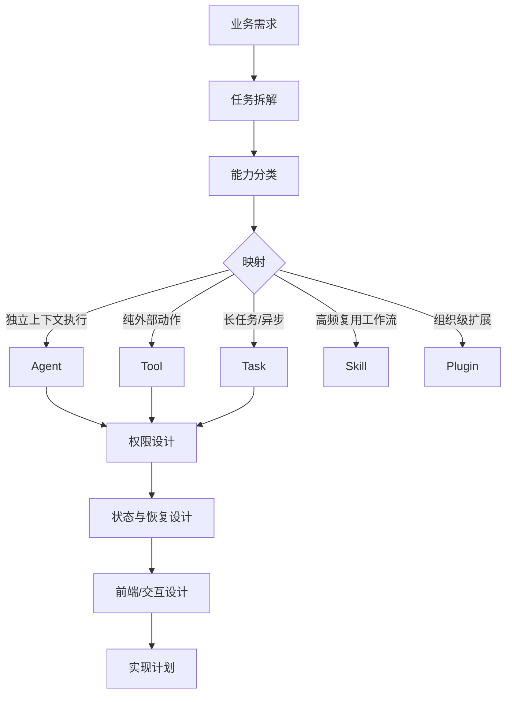

### 28.2 固定步骤

#### Step 1：业务需求拆成任务单元

问：

- 哪些是一次性动作
- 哪些是长流程
- 哪些需要等待外部系统
- 哪些需要人工确认

#### Step 2：任务单元映射到 runtime 对象

规则建议如下：

- 纯动作型能力 -> `Tool`
- 有生命周期与输出文件/通知需求 -> `Task`
- 需要独立上下文和自主执行 -> `Agent`
- 可复用业务流程 -> `Skill`
- 组织/产品级能力包 -> `Plugin`

#### Step 3：定义 agent 边界

必须写清：

- 目标
- 输入
- 输出
- 可用工具
- 禁用工具
- 是否后台
- 是否需要验证器
- 是否需要隔离环境

#### Step 4：定义权限模式

必须写清：

- 哪些工具默认允许
- 哪些需要人工审批
- 哪些在自动模式下禁用
- 哪些数据源受组织策略限制

#### Step 5：定义恢复语义

必须写清：

- 任务中断后如何恢复
- 输出记录在哪里
- 会话如何 resume
- 是否需要 side transcript

#### Step 6：定义交互壳

必须写清：

- 用户在哪输入
- 用户在哪看进度
- 用户如何中断
- 用户如何继续已存在 worker

---

## 29. 给未来 AI 使用的标准分析提示模板

以后你把这份文档和业务需求一起丢给 AI，可以要求 AI 按下面格式输出。

### 29.1 模板：需求转 Runtime 设计

```text
你现在的任务不是直接写代码，而是基于附带的 Claude Code runtime 分析文档，把下面业务需求转译成一个可实现的 Agent Runtime 设计。

请严格按以下结构输出：

1. 需求拆解
- 将业务目标拆成若干任务单元
- 标注哪些是同步动作，哪些是长任务，哪些需要人工审批

2. Runtime 映射
- 哪些应实现为 Tool
- 哪些应实现为 Task
- 哪些应实现为 Agent
- 哪些应实现为 Skill
- 哪些应实现为 Plugin

3. Agent 设计
- 每个 agent 的目标
- 输入 / 输出
- 工具边界
- 是否后台运行
- 是否需要 verifier
- 是否需要 remote / worktree isolation

4. Permission 设计
- 默认允许工具
- 需要审批的工具
- 自动模式下必须剥离的权限
- 企业/组织策略约束

5. State 与 Resume 设计
- 需要持久化什么
- 如何恢复
- 是否需要 transcript / side output / notification

6. 实现蓝图
- 先实现哪些模块
- 模块之间的依赖顺序
- MVP 与第二阶段增强项

不要泛泛而谈，要使用文档里的抽象：QueryEngine, Query Loop, Tool, Task, AgentTool, Permission Context, Skills, Plugins, MCP, Resume。
```

### 29.2 模板：直接生成 Agent Spec

```text
基于附带的 Claude Code runtime 文档，针对以下业务需求，直接产出一组 Agent Specs。

每个 Agent Spec 必须包含：
- name
- purpose
- trigger
- input schema
- output schema
- allowed tools
- disallowed tools
- permission mode
- background or foreground
- isolation mode
- memory policy
- verification policy
- failure handling
- resume policy
```

### 29.3 模板：直接生成实现计划

```text
你现在作为系统架构师，不是作为普通助手。
请基于附带的 Claude Code runtime 文档与以下业务需求，输出一个可执行 implementation plan。

要求：
- 按 QueryEngine / Tool Registry / Task Runtime / Permission Engine / Frontend Shell 五个层次展开
- 必须说明哪些能力借鉴 Claude Code，哪些地方应针对我们的业务做改造
- 输出 MVP、Phase 2、Phase 3
```

---

## 30. 未来你应该把这份文档继续演化成什么

如果你的目标是“以后丢给 AI 就能快速造 agent”，这份文档接下来最值得演化成三件东西：

### 30.1 `Runtime Canon`

定义你团队内部稳定采用的 runtime 术语和抽象边界。

建议新增一份配套文档：

- `Agent Runtime 术语表.md`

### 30.2 `Agent Spec Cookbook`

定义不同业务场景下 agent 的标准模板。

建议新增一份配套文档：

- `Agent 设计模板与范式.md`

### 30.3 `需求转译手册`

把“业务需求 -> runtime 设计”的规则固化下来。

建议新增一份配套文档：

- `业务需求到 Agent Runtime 的转译手册.md`

---

## 31. 对你当前目标的直接建议

如果你的真实目标是：

> 未来给 AI 一份高质量上下文，AI 就能快速按我的业务需求构建 agent

那么 Claude Code 这份研究文档的最佳用途不是“帮助 AI 复刻 Claude Code”，而是：

- 帮助 AI 学会 `runtime thinking`
- 帮助 AI 学会 `task-first design`
- 帮助 AI 学会 `tool/task/agent/permission` 的稳定映射关系

你最终要沉淀的不是一份源码讲解，而是一套：

- 设计语言
- 决策规则
- 模块模板
- 实施流程

Claude Code 只是第一性参考样本。

---

## 32. 下一步最推荐的补文档顺序

为了把这套知识真正变成未来 AI 的高质量构建上下文，下一步最推荐继续补这三份文档：

1. `Agent Runtime 术语表`
   - 把 QueryEngine / Query Loop / Tool / Task / Agent / Skill / Plugin / Permission Context 统一定义清楚

2. `业务需求到 Agent Runtime 的转译手册`
   - 把不同需求如何映射成 runtime 组件的规则写成固定框架

3. `Agent 设计模板与范式`
   - 提供可直接复用的 Agent Spec / Tool Spec / Task Spec 模板

这样以后你给 AI 的上下文就不是“一个项目分析”，而是一套可以直接驱动实现的构建规范。

---

## 文档导航

- 返回目录：[[记忆库/语义记忆/claude-code-sourcemap-main/README|README]]
- 抽象术语统一：[[Agent Runtime 术语表]]
- 需求转 runtime：[[业务需求到 Agent Runtime 的转译手册]]
- 直接生成设计模板：[[Agent 设计模板与范式]]
- 直接喂给 AI：[[给 AI 的标准总提示词]]
- 转到工程实施：[[Agent Runtime 实施路线图]]
