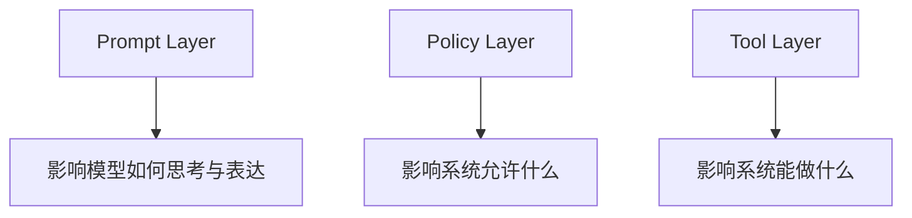

# Prompt ／ Policy ／ Tool 三层边界说明

> 返回入口：[[记忆库/语义记忆/claude-code-sourcemap-main/README|README]]
>
> 关联文档：
> - [[Agent Runtime 术语表]]
> - [[业务需求到 Agent Runtime 的转译手册]]
> - [[Agent 设计模板与范式]]
> - [[Agent 评审清单]]
> - [[业务域专用 Tool 模板库]]

## 文档定位

这份文档的目标，是防止以后 AI 或人类在设计 agent 系统时，把 `Prompt`、`Policy`、`Tool` 三层边界混在一起。  
这类混淆是很多 agent 方案最后不可控、不可审计、不可维护的根源。

---

## 1. 三层总图



### 一句话定义

- `Prompt`：告诉模型应该如何理解、规划、表达
- `Policy`：告诉 runtime 什么允许、什么禁止、什么需要审批
- `Tool`：告诉 runtime 和模型 有哪些能力可以被调用

---

## 2. Prompt Layer

### 2.1 Prompt 层负责什么

- 角色定义
- 输出风格
- 任务目标提醒
- 推理偏好
- 交流方式

### 2.2 Prompt 层不该负责什么

- 不应该定义真实权限
- 不应该假装某个工具存在
- 不应该替代审计或审批
- 不应该承担恢复机制

### 2.3 Prompt 适合表达的内容

- “你是一个 verifier agent”
- “优先输出结构化 findings”
- “不要直接改代码，先确认范围”

### 2.4 Prompt 不适合表达的内容

- “你只能访问这些目录”
- “你绝不能执行 shell”
- “你可以安全地发消息给客户”

这些应该属于 policy 或 tool boundary，而不是只写进 prompt。

---

## 3. Policy Layer

### 3.1 Policy 层负责什么

- allow / deny 规则
- approval requirements
- org / project / user constraints
- auto mode stripping
- 审计要求

### 3.2 Policy 层不该负责什么

- 不负责提供具体能力
- 不负责风格和语气
- 不负责具体实现逻辑

### 3.3 Policy 适合表达的内容

- shell_exec 必须审批
- prod_exec 默认拒绝
- 仅允许访问指定 workspace
- outbound_message_send 在 auto mode 下禁用

---

## 4. Tool Layer

### 4.1 Tool 层负责什么

- 提供能力原语
- 定义输入输出
- 定义副作用
- 定义并发安全性
- 定义执行行为

### 4.2 Tool 层不该负责什么

- 不负责高层业务目标
- 不负责风格与语气
- 不负责组织策略

### 4.3 Tool 适合表达的内容

- file_read(path)
- crm_update(entity_id, updates)
- outbound_message_send(channel, recipient, content)

---

## 5. 三层关系

### 5.1 正确关系

```text
Prompt 指导模型行为
Policy 约束运行时边界
Tool 提供可调用能力
```

### 5.2 错误关系

```text
用 Prompt 假装做权限控制
用 Tool 名字隐含组织策略
用 Policy 假装提供能力
```

---

## 6. 典型错误案例

### 错误一：把权限写进 Prompt

例子：

- “你绝不要执行 shell 命令”

问题：

- 模型只是被提醒，没有真正 runtime 保证

正确做法：

- 在 Prompt 中提醒
- 在 Policy 中真正禁掉 shell_exec

### 错误二：用 Tool 名字偷塞策略

例子：

- 工具叫 `safe_delete_file`

问题：

- “safe” 不是策略保证

正确做法：

- Tool 定义删除行为
- Policy 决定何时允许删除

### 错误三：用 Policy 表达业务流程

例子：

- “每次都先分析再执行” 写成 policy

问题：

- 这其实是 workflow / prompt / agent design，不是 policy

---

## 7. 正确的设计拆分方式

### 场景：客户消息发送

#### Prompt 应写

- 先判断是否真的需要发送消息
- 草稿要简洁、礼貌、准确

#### Policy 应写

- 自动模式下禁止直接发送
- 发送前必须人工审批

#### Tool 应写

- `outbound_message_send(channel, recipient, content)`
- 明确定义输入输出和副作用

### 场景：执行生产环境命令

#### Prompt 应写

- 优先诊断
- 没有充分证据不要执行高风险操作

#### Policy 应写

- `prod_exec` 默认拒绝
- 只有特定审批后才能执行

#### Tool 应写

- `prod_exec(command, target)`

---

## 8. 对未来 AI 的硬性要求

以后任何 AI 设计 agent 系统时，必须明确回答：

1. 哪些规则属于 Prompt？
2. 哪些规则属于 Policy？
3. 哪些能力属于 Tool？

如果这三层没有拆清楚，方案默认不合格。

---

## 9. 三层边界评审清单

### Prompt 检查

- 是否只是行为指导，而不是权限假设？
- 是否没有虚构能力？

### Policy 检查

- 是否真正定义 allow / deny / approval？
- 是否没有混入 workflow 逻辑？

### Tool 检查

- 是否只定义能力，不承载高层策略？
- 是否定义输入输出和副作用？

---

## 10. 给 AI 的使用模板

```text
请基于附带的 Prompt / Policy / Tool 三层边界说明，对以下 agent 设计做边界审查。

要求：
1. 把设计中的内容拆成 Prompt / Policy / Tool 三层
2. 指出哪些内容放错层了
3. 给出正确重构方式
4. 最后输出重构后的三层结构
```

---

## 11. 一句话版本

> Prompt 决定模型怎么想和怎么说，Policy 决定系统允许什么，Tool 决定系统能做什么，这三层不能混。
