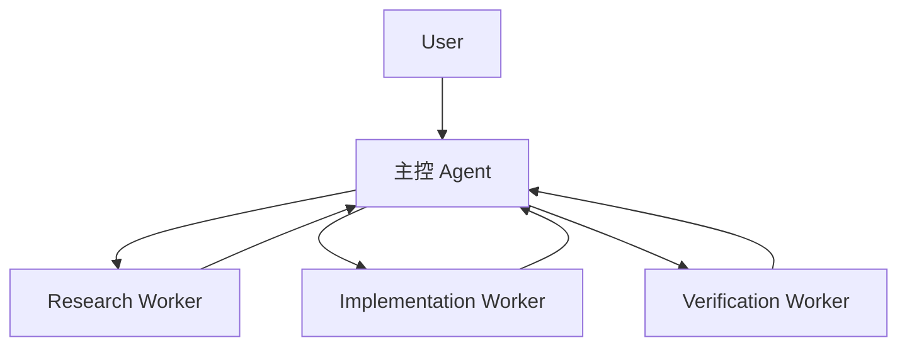
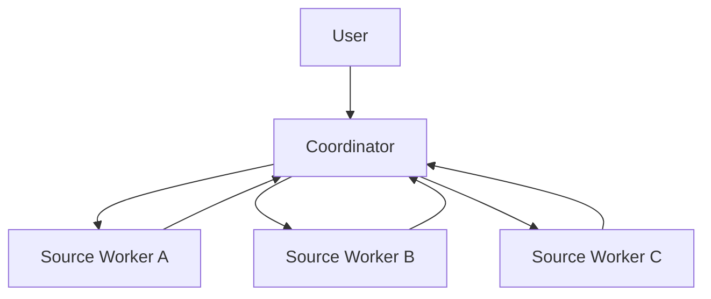
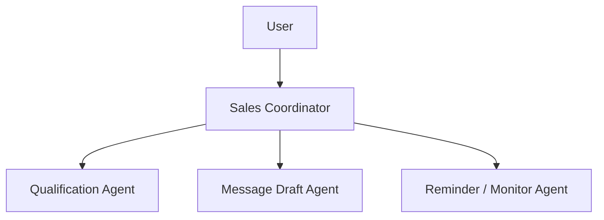
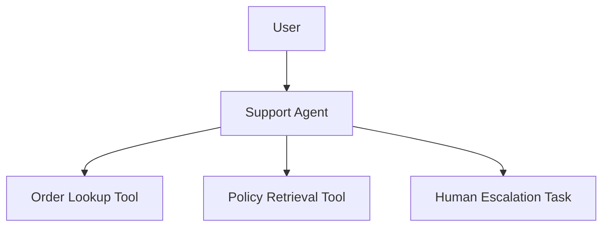
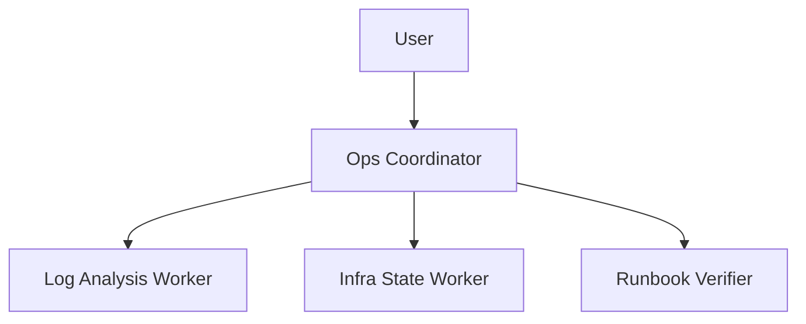

# 业务场景 Agent 蓝图库

> 返回入口：[[记忆库/语义记忆/claude-code-sourcemap-main/README|README]]
>
> 关联文档：
> - [[Agent Runtime 术语表]]
> - [[业务需求到 Agent Runtime 的转译手册]]
> - [[Agent 设计模板与范式]]
> - [[给 AI 的标准总提示词]]
> - [[Agent Runtime 实施路线图]]

## 文档定位

这份文档的目标，是把常见业务场景直接沉淀成可复用的 Agent Runtime 蓝图。  
它不是源码分析，也不是抽象模板，而是介于两者之间的“半成品设计库”。

以后你给 AI 新需求时，可以先看这里有没有相近场景，再让 AI 在此基础上改造，而不是每次从零开始。

---

## 1. 使用方式

每个蓝图都包含：

- 场景目标
- 推荐 runtime 结构
- 推荐 agents
- 推荐 tools
- 推荐 tasks
- permission / resume 建议
- MVP 形态

推荐使用方式：

1. 先在本页找最接近的场景
2. 再结合 [[业务需求到 Agent Runtime 的转译手册]] 做定制映射
3. 最后用 [[Agent 设计模板与范式]] 生成正式 specs

---

## 2. Coding Agent 蓝图

### 2.1 适用场景

- 代码库分析
- 功能实现
- bug 修复
- review / verify

### 2.2 推荐 runtime 结构



### 2.3 推荐 agents

- 主控 Agent
  - 负责理解用户目标、拆解任务、综合结果
- Research Worker
  - 负责只读分析、定位代码、理解依赖
- Implementation Worker
  - 负责执行修改
- Verification Worker
  - 负责测试、验证、找残余风险

### 2.4 推荐 tools

- file_read
- grep / glob / repo_search
- file_edit / write
- shell_exec
- git_ops
- diagnostics / tests
- agent_spawn

### 2.5 推荐 tasks

- background_agent_task
- execution_task
- verification_task

### 2.6 Permission 建议

- `shell_exec` 需要审批或受限 allowlist
- 写操作与 git 操作应纳入审计
- auto mode 下必须剥离任意执行 wildcard 权限

### 2.7 Resume 建议

- transcript 必须持久化
- task metadata 必须持久化
- implementation / verification 输出建议独立 side output

### 2.8 MVP 建议

- 只做 terminal + 单仓 coding agent
- 先不做 remote runtime
- 先不做 plugin marketplace

---

## 3. 研究型 Agent 蓝图

### 3.1 适用场景

- 资料调研
- 竞品分析
- 长文档阅读与归纳
- 多来源信息整合

### 3.2 推荐 runtime 结构



### 3.3 推荐 agents

- Coordinator
  - 负责拆问题、分来源、综合发现
- Source Workers
  - 负责并行抓取和总结特定来源
- Optional Verifier
  - 负责检查引用和结论一致性

### 3.4 推荐 tools

- web_search
- web_fetch
- document_reader
- citation_extractor
- list_resources
- read_resource

### 3.5 推荐 tasks

- background_research_task
- source_fetch_task

### 3.6 Permission 建议

- 默认 read-only
- 网络访问按域名 allowlist 控制
- 结果应保留来源引用

### 3.7 Resume 建议

- 长研究任务必须可 resume
- 中间 findings 应结构化落盘

### 3.8 MVP 建议

- 先做 coordinator + 多 read-only workers
- 先不做复杂记忆系统

---

## 4. 销售 Agent 蓝图

### 4.1 适用场景

- 线索筛选
- 客户跟进
- CRM 更新
- 跟进提醒

### 4.2 推荐 runtime 结构



### 4.3 推荐 agents

- Sales Coordinator
- Qualification Agent
- Message Draft Agent
- Follow-up Monitor Agent

### 4.4 推荐 tools

- crm_read
- crm_update
- email_draft
- message_send
- calendar_lookup
- reminder_create

### 4.5 Permission 建议

- 发信/发消息必须有审批或至少 human-in-the-loop
- CRM 写入要审计

### 4.6 Resume 建议

- 客户线程必须持久化
- 监控/提醒任务必须可恢复

### 4.7 MVP 建议

- 先做 draft，不做自动发送
- 先做人审通过后的 CRM 更新

---

## 5. 客服 / 运营 Agent 蓝图

### 5.1 适用场景

- 工单处理
- FAQ 回答
- 订单状态查询
- 人工升级

### 5.2 推荐 runtime 结构



### 5.3 推荐 agents

- Support Main Agent
- Optional Policy Verifier
- Optional Escalation Agent

### 5.4 推荐 tools

- order_lookup
- faq_search
- policy_search
- refund_request_draft
- escalation_create

### 5.5 Permission 建议

- 高风险操作不能自动执行
- 涉及退款、账户修改时必须审批

### 5.6 Resume 建议

- 每个工单为独立 conversation / case
- 人工交接需要 transcript 摘要

### 5.7 MVP 建议

- 先做查询与建议
- 不直接做退款和账户修改

---

## 6. DevOps / 运维 Agent 蓝图

### 6.1 适用场景

- 日志分析
- 环境巡检
- 发布检查
- 自动恢复建议

### 6.2 推荐 runtime 结构



### 6.3 推荐 agents

- Ops Coordinator
- Log Analysis Worker
- Infra State Worker
- Runbook Verifier

### 6.4 推荐 tools

- log_search
- metrics_query
- kubernetes_read
- infra_exec
- runbook_lookup

### 6.5 Permission 建议

- 默认 read-only
- 生产写操作必须审批
- shell / kubectl / terraform 类工具必须强策略控制

### 6.6 Resume 建议

- incident timeline 要持久化
- remediation proposal 要带 evidence

### 6.7 MVP 建议

- 先做诊断与建议
- 不直接自动执行恢复动作

---

## 7. 文档 / 内容生产 Agent 蓝图

### 7.1 适用场景

- 写文档
- 写博客
- 总结会议纪要
- 内容结构化生产

### 7.2 推荐 runtime 结构

- 主控 agent
- research worker
- drafting worker
- editing / polishing worker

### 7.3 推荐 tools

- document_read
- outline_generator
- style_checker
- publishing_tool

### 7.4 Permission 建议

- 自动发布要审批
- 外部内容抓取应保留来源

### 7.5 MVP 建议

- 先做草稿与编辑
- 不做自动发布

---

## 8. 企业内部知识助手蓝图

### 8.1 适用场景

- 内部文档问答
- 知识检索
- 标准流程导航

### 8.2 推荐 runtime 结构

- 主问答 agent
- retrieval tool
- policy / SOP skill
- escalation path

### 8.3 推荐 tools

- doc_search
- doc_read
- org_directory_lookup
- process_lookup

### 8.4 Permission 建议

- 访问范围按部门/角色控制
- 敏感资料有明确 deny rules

### 8.5 Resume 建议

- session memory 可以较强
- 但需避免越权信息泄露

---

## 9. 场景选择速查表

| 场景 | 默认结构 | 是否需要多 Agent | 是否需要 Task Runtime | 是否强依赖 Resume |
|---|---|---|---|---|
| Coding | Coordinator + R/I/V Workers | 是 | 是 | 是 |
| 研究 | Coordinator + Read-only Workers | 是 | 是 | 是 |
| 销售 | Coordinator + Draft + Monitor | 通常是 | 是 | 是 |
| 客服 | Main Agent + Tools + Escalation | 视情况 | 中等 | 中等 |
| DevOps | Coordinator + Diagnostics + Verifier | 是 | 是 | 是 |
| 文档生产 | Main + Research + Draft + Edit | 通常是 | 中等 | 中等 |
| 内部知识问答 | Main Agent + Retrieval | 不一定 | 低到中 | 中等 |

---

## 10. 给 AI 的使用模板

```text
请基于附带的业务场景蓝图库、术语表、需求转译手册和 Agent 模板文档，判断以下业务需求最接近哪个蓝图。

然后输出：
1. 最接近的蓝图
2. 哪些部分可以直接复用
3. 哪些部分必须改造
4. 改造后的 runtime 设计
5. 最终 Agent Specs
```

---

## 11. 一句话版本

> 这份蓝图库的作用，是把“从零设计 agent”升级成“基于成熟场景蓝图快速变体设计 agent”。
