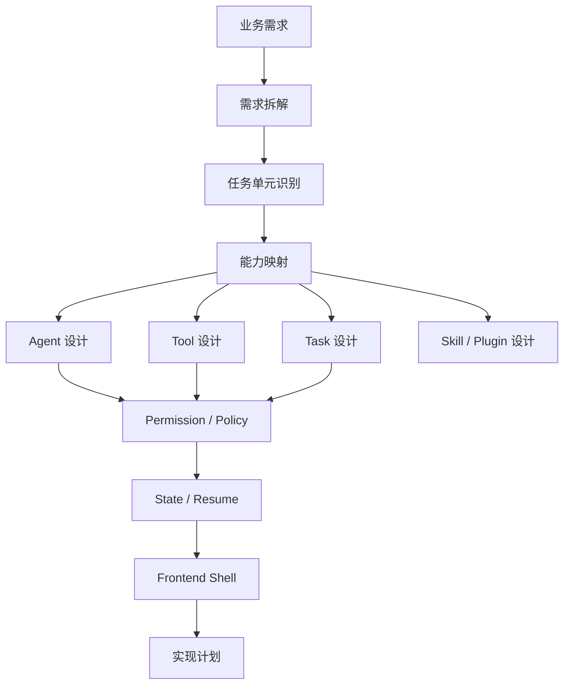

# 业务需求到 Agent Runtime 的转译手册

> 返回入口：[[记忆库/语义记忆/claude-code-sourcemap-main/README|README]]
>
> 关联文档：
> - [[Agent Runtime 术语表]]
> - [[Agent 设计模板与范式]]
> - [[Claude Code 架构全景与时序分析]]
> - [[给 AI 的标准总提示词]]
> - [[Agent Runtime 实施路线图]]

## 文档定位

这份文档的目标，是把业务需求稳定转译成可实现的 Agent Runtime 设计。  
它不是架构赏析，而是一份 `decision manual`。

以后给 AI 这套知识库时，这份文档应该和术语表一起优先输入。

配套文档：

- `Agent Runtime 术语表.md`
- `Agent 设计模板与范式.md`
- `Claude Code 架构全景与时序分析.md`

---

## 1. 转译目标

业务需求进入系统后，最终要得到的不是“一个模糊 agent”，而是以下可实现对象的组合：

- Frontend Shell 设计
- Query Engine 设计
- Tool 列表
- Task 列表
- Agent 列表
- Skill 列表
- Plugin 边界
- Permission / Policy 设计
- State / Resume 设计

最终产物必须可以回答：

1. 用户从哪里触发？
2. 谁负责理解意图？
3. 哪些能力由模型直接调用？
4. 哪些能力应拆成任务？
5. 哪些任务需要独立 agent？
6. 哪些动作需要审批？
7. 中断后如何恢复？

---

## 2. 总体转译流程



---

## 3. 第一步：需求拆解

### 3.1 必问问题

拿到任何业务需求时，先要求 AI 明确回答：

1. 用户目标是什么？
2. 成功的定义是什么？
3. 输入是什么？
4. 输出是什么？
5. 是否需要调用外部系统？
6. 是否存在长时任务？
7. 是否存在人工审批或人工补充信息？
8. 是否需要审计、恢复、通知？

### 3.2 输出格式

建议 AI 先把需求拆成任务单元：

| 任务单元 | 目标 | 输入 | 输出 | 时长 | 风险 | 是否需要人工 |
|---|---|---|---|---|---|---|

### 3.3 拆解原则

- 按执行边界拆，不按页面拆
- 按职责拆，不按团队组织拆
- 避免一个任务单元同时承担研究、执行、验证三种职责

---

## 4. 第二步：任务单元识别

### 4.1 任务单元分类

对每个任务单元，必须先归类：

#### A. 即时动作

特征：

- 秒级完成
- 不需要长期状态
- 通常返回一次结果

例子：

- 读取文件
- 调用内部查询接口
- 生成摘要

#### B. 长任务

特征：

- 需要较长时间
- 需要进度与状态
- 可能被取消或恢复

例子：

- 全仓分析
- 大量文档抓取
- 多轮自动修复

#### C. 协作任务

特征：

- 需要不同角色处理不同部分
- 适合拆给多个 worker

例子：

- 研究 + 实现 + 验证
- 多系统并行收集信息

#### D. 审批任务

特征：

- 需要人工确认
- 高风险 side effect

例子：

- 执行数据库变更
- 批量外发消息
- 删除资源

---

## 5. 第三步：映射成 Runtime 对象

这是最关键的一步。

### 5.1 映射规则总表

| 需求特征 | 首选对象 | 说明 |
|---|---|---|
| 小粒度、模型直接可决策调用 | Tool | 适合能力原语 |
| 需要进度、状态、恢复 | Task | 适合生命周期管理 |
| 需要独立上下文自主执行 | Agent | 适合子执行者 |
| 高复用的工作流 / 规则包 | Skill | 适合轻量能力封装 |
| 可安装、命名空间扩展 | Plugin | 适合重型扩展 |
| 用户显式入口 | Command | 适合 user-facing API |

### 5.2 Tool 的判定规则

优先建模为 Tool 的条件：

- 输入输出相对清晰
- 行为粒度较小
- 模型需要自行决定何时调用
- 可通过 schema 严格约束

不要建模为 Tool 的情况：

- 需要长生命周期
- 需要多步骤状态推进
- 需要后台运行

### 5.3 Task 的判定规则

优先建模为 Task 的条件：

- 耗时较长
- 有中断恢复需求
- 需要在 UI 显示状态
- 需要 completion notification

### 5.4 Agent 的判定规则

优先建模为 Agent 的条件：

- 需要独立上下文
- 需要自主规划下一步
- 需要自主选工具
- 需要产出独立结果

### 5.5 Skill 的判定规则

优先建模为 Skill 的条件：

- 同类工作会反复发生
- 规则可以声明式表达
- 适合被多个 agent 复用

### 5.6 Plugin 的判定规则

优先建模为 Plugin 的条件：

- 能力需要独立发布
- 有明确命名空间
- 需要自带配置或资源

---

## 6. 第四步：Agent 设计

### 6.1 每个 Agent 必须明确回答的问题

1. 这个 agent 的目标是什么？
2. 它的输入是什么？
3. 它的输出是什么？
4. 它能调用哪些工具？
5. 它不能调用哪些工具？
6. 它是前台、后台还是远程？
7. 它需要 verifier 吗？
8. 它失败后怎么处理？
9. 它中断后怎么恢复？

### 6.2 Agent 角色分类建议

#### 主控型 Agent

职责：

- 理解用户目标
- 总控流程
- 与用户对话

#### 研究型 Agent

职责：

- 收集上下文
- 做只读分析
- 产出结构化发现

#### 执行型 Agent

职责：

- 进行有副作用操作
- 改数据、改文件、发请求

#### 验证型 Agent

职责：

- 独立验证结果
- 不继承执行者的偏见

#### 监控型 Agent

职责：

- 长期观察状态
- 条件达成后通知

### 6.3 Agent 拆分原则

- 拆职责，不拆情绪
- 拆边界，不拆术语
- 优先按上下文边界和副作用边界拆
- 避免一个 agent 同时承担：
  - 研究
  - 执行
  - 验证

---

## 7. 第五步：Tool 设计

### 7.1 每个 Tool 必须明确回答的问题

1. 名称是什么？
2. 输入 schema 是什么？
3. 输出 schema 是什么？
4. 是否有副作用？
5. 是否并发安全？
6. 需要什么权限？
7. 出错时如何表示？

### 7.2 Tool 分类建议

#### Read-only Tools

- 文件读取
- 检索
- 元数据查询
- 外部系统只读 API

#### Mutating Tools

- 文件写入
- Shell 执行
- 外部资源修改
- 发送消息

#### Meta Tools

- Agent Spawn Tool
- Task Control Tool
- Plan Mode Tool

### 7.3 Tool 设计原则

- schema 必须严格
- 错误必须结构化
- side effect 必须可审计
- 并发安全性必须显式声明

---

## 8. 第六步：Task 设计

### 8.1 每个 Task 必须明确回答的问题

1. task id 如何生成？
2. 状态机有哪些状态？
3. 结果写到哪里？
4. 进度如何回传？
5. 是否能恢复？
6. 什么时候通知主会话？

### 8.2 标准状态建议

- `pending`
- `running`
- `completed`
- `failed`
- `killed`

### 8.3 Task 类型建议

- `local_tool_task`
- `background_agent_task`
- `remote_agent_task`
- `workflow_task`
- `monitor_task`

### 8.4 何时必须有 Task

以下任一成立，就应认真考虑 Task 化：

- 运行超过数秒
- 需要在 UI 显示进度
- 需要通知
- 需要恢复
- 需要后台运行

---

## 9. 第七步：Permission / Policy 设计

### 9.1 必须定义的权限层次

#### Session 权限

- 当前会话允许什么
- 当前 agent 允许什么

#### User 权限

- 用户级偏好与安全边界

#### Project 权限

- 项目目录范围
- 项目集成限制

#### Org 权限

- 企业策略
- 数据访问范围

### 9.2 必须明确的审批点

以下情况一般都应触发审批或更严格策略：

- 删除操作
- 大范围写操作
- 发消息/发邮件/发 PR
- 执行 shell
- 执行数据库变更
- 启动新 agent 且拥有高权限

### 9.3 自动模式下必须审查的问题

1. 是否存在任意代码执行工具？
2. 是否存在自动生成外部 side effect？
3. 是否存在 agent 自发派生更多 agent 的风险？
4. 是否存在远程外联与 secrets 泄露风险？

---

## 10. 第八步：State / Resume 设计

### 10.1 必须回答的问题

1. 哪些状态只存在内存中？
2. 哪些状态必须持久化？
3. 哪些任务支持 resume？
4. resume 时如何恢复上下文边界？
5. transcript 和 memory 的边界是什么？

### 10.2 推荐持久化对象

- conversation transcript
- task metadata
- output files
- external references
- file mutation history
- permission decisions

### 10.3 Resume 原则

- 恢复的是运行状态，而不是仅恢复聊天记录
- 不要靠“让模型自己重新理解历史”替代真正的状态恢复
- 对后台任务和远程任务，必须有独立恢复元数据

---

## 11. 第九步：Frontend Shell 设计

### 11.1 必须回答的问题

1. 用户从哪里发起？
2. 用户如何看到当前有哪些任务在跑？
3. 用户如何打断？
4. 用户如何继续一个已存在 worker？
5. 用户如何处理审批请求？

### 11.2 常见 Shell 设计模式

#### Terminal-first

适合：

- 开发者工具
- coding agent

#### IDE-first

适合：

- 代码上下文强依赖
- 需要 diff/diagnostics 深集成

#### Web-first

适合：

- 业务工作流
- 非技术用户
- 多人协作和运营后台

#### API-first

适合：

- 嵌入式 agent 平台
- B2B 平台能力输出

---

## 12. 标准输出结构：要求 AI 必须这样产出

以后让 AI 根据业务需求设计 agent 系统时，要求固定输出以下结构：

### 12.1 输出模板

1. 需求拆解
2. Runtime 对象映射
3. Agent 设计
4. Tool 设计
5. Task 设计
6. Permission / Policy 设计
7. State / Resume 设计
8. Frontend Shell 设计
9. MVP 方案
10. 后续增强项

### 12.2 不允许的低质量输出

- 只说“做一个 agent”
- 只给 prompt，不给 runtime 设计
- 只给流程图，不给对象边界
- 只说“接入 MCP”，但不说明进入哪个 capability plane
- 只说“后台运行”，但不给 task 状态与恢复机制

---

## 13. 业务场景速配表

### 13.1 Coding Agent

建议映射：

- 主控 Agent
- Research Worker
- Implementation Worker
- Verification Worker
- File / Search / Shell / Git Tools
- Task Runtime
- Worktree / Remote Isolation

### 13.2 客服 / 运营 Agent

建议映射：

- 主对话 Agent
- 数据查询 Tool
- 消息发送 Tool
- 人工审批节点
- Audit Transcript
- Skill-based Playbooks

### 13.3 销售 Agent

建议映射：

- Lead Qualification Agent
- CRM Tool
- Email / Message Tool
- Reminder / Background Monitor Task
- Policy-based approval

### 13.4 研究 Agent

建议映射：

- Coordinator
- 并行 Research Workers
- Read-only tools
- Citation / source tracking
- 长时 background tasks

---

## 14. 给 AI 的标准提示模板

### 14.1 模板一：从需求生成 runtime 设计

```text
基于附带的 Agent Runtime 术语表、需求转译手册和 Agent 模板文档，请把以下业务需求转译成可实现的 Agent Runtime 设计。

严格输出：
1. 需求拆解
2. Runtime 对象映射
3. Agent 设计
4. Tool 设计
5. Task 设计
6. Permission / Policy 设计
7. State / Resume 设计
8. Frontend Shell 设计
9. MVP / Phase 2 / Phase 3

不要只给 prompt，必须给 runtime 对象边界与理由。
```

### 14.2 模板二：从需求直接生成实现计划

```text
你现在不是普通助手，而是 Agent Runtime Architect。
请基于附带文档，把以下业务需求转成 implementation plan。

计划必须按以下层次展开：
- Frontend Shell
- Conversation Orchestrator
- Query Engine
- Query Loop
- Tool Registry
- Task Runtime
- Permission / Policy
- Resume / Memory

每一层都要写：
- 为什么需要
- 设计什么
- 与其他层如何连接
- MVP 怎么做
```

---

## 15. 一句话版本

> 这份手册的作用，是让未来的 AI 不再直接“写一个 agent”，而是先把业务需求转译成清晰的 Tool、Task、Agent、Skill、Plugin、Permission、Resume 这些 runtime 对象，再去实现。

---

## 文档导航

- 返回目录：[[记忆库/语义记忆/claude-code-sourcemap-main/README|README]]
- 回查抽象术语：[[Agent Runtime 术语表]]
- 套用模板：[[Agent 设计模板与范式]]
- 查看 Claude Code 参考样本：[[Claude Code 架构全景与时序分析]]
- 直接投喂 AI：[[给 AI 的标准总提示词]]
- 转入工程落地：[[Agent Runtime 实施路线图]]
