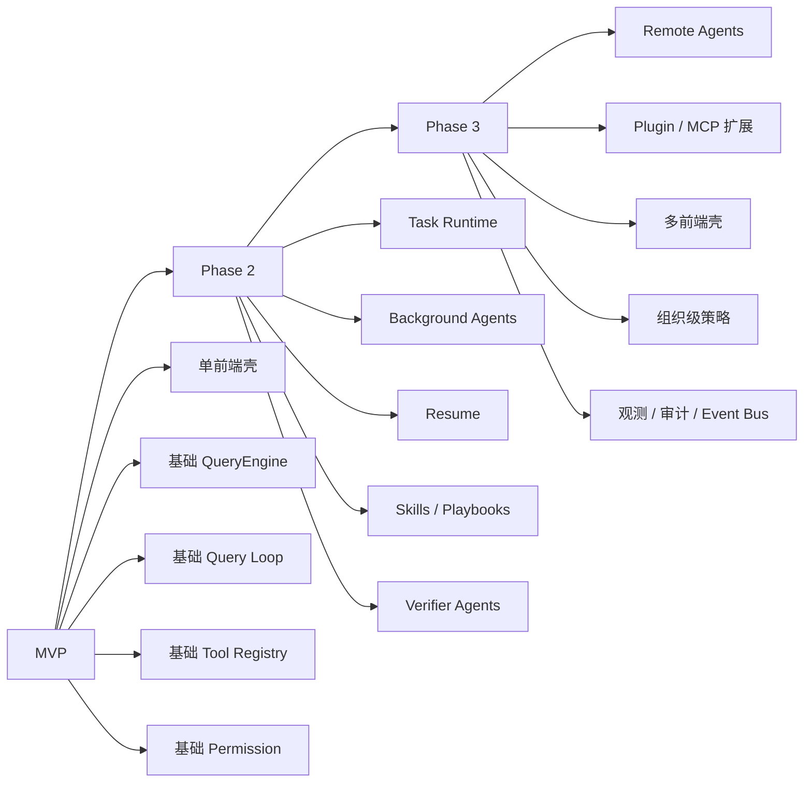
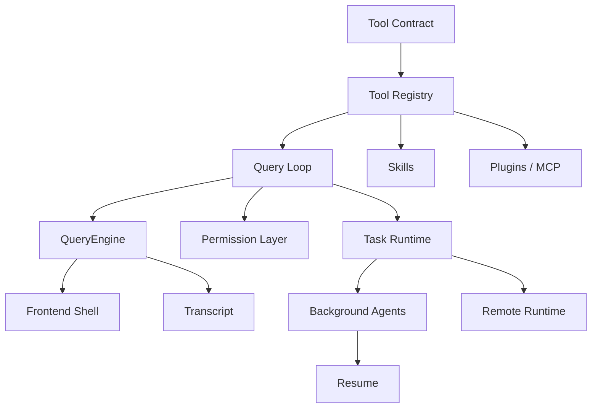

# Agent Runtime 实施路线图

> 返回入口：[[记忆库/语义记忆/claude-code-sourcemap-main/README|README]]
>
> 关联文档：
> - [[Agent Runtime 术语表]]
> - [[业务需求到 Agent Runtime 的转译手册]]
> - [[Agent 设计模板与范式]]
> - [[Claude Code 架构全景与时序分析]]
> - [[给 AI 的标准总提示词]]
> - [[业务场景 Agent 蓝图库]]
> - [[Agent 评审清单]]

## 文档定位

这份文档的目标，是把 Agent Runtime 从“概念设计”推进到“工程实施”。  
它不是某个业务项目的具体计划，而是一份面向你未来产品的通用路线图。

你可以把它当成：

- 实施阶段的参考蓝图
- 模块分层与依赖顺序说明
- MVP / Phase 2 / Phase 3 的标准推进框架

---

## 1. 实施目标

最终希望构建出来的是一套具有以下能力的 runtime：

- 支持多前端壳
- 支持 QueryEngine + Query Loop
- 支持 Tool Registry
- 支持 Task Runtime
- 支持多 Agent
- 支持 Permission / Policy
- 支持 Transcript / Resume
- 支持 Skills / Plugins / MCP 风格扩展

但不要一开始就全做。  
正确方式是按依赖顺序分阶段推进。

---

## 2. 总体阶段划分



---

## 3. Phase 0：开始前必须先确定的事

在正式实施之前，先把以下内容确定下来：

### 3.1 产品边界

- 这是 coding agent，还是通用业务 agent？
- 主要前端壳是什么？
- 用户是开发者，还是业务用户？

### 3.2 风险边界

- 是否允许 shell / code execution？
- 是否允许外部 side effects？
- 是否需要组织级审计？

### 3.3 成功标准

- MVP 成功的定义是什么？
- 第一阶段是“能工作”，还是“能规模化复用”？

如果这些问题不先明确，后面的 runtime 设计很容易过重或过轻。

---

## 4. MVP：先把最小闭环跑起来

### 4.1 MVP 目标

MVP 不是做“完整 Claude Code”，而是做出最小闭环：

- 用户输入
- QueryEngine 维护会话
- Query Loop 能调模型与工具
- 工具能产生有效副作用或读取结果
- 有基本权限控制

### 4.2 MVP 推荐模块

#### 模块一：单一 Frontend Shell

建议只做一个壳：

- Terminal，如果目标偏开发者
- Web，如果目标偏业务流程

不要一开始同时做多壳。

#### 模块二：Conversation Orchestrator

最小职责：

- 接受用户输入
- 路由到 QueryEngine
- 渲染输出事件流

#### 模块三：基础 QueryEngine

必须具备：

- conversation message store
- system/user context assembly
- turn submission

#### 模块四：基础 Query Loop

必须具备：

- 流式请求
- tool use 检测
- 执行工具
- tool result 回灌
- terminal return

#### 模块五：最小 Tool Registry

建议只做 5 类工具：

- read/search
- write/edit
- exec
- network/read
- agent_spawn

#### 模块六：最小 Permission Layer

至少支持：

- allow list
- deny list
- 审批前置

### 4.3 MVP 不建议一开始做的东西

- remote agents
- plugin marketplace
- 多前端壳
- 复杂长期 memory
- 复杂组织级策略
- 复杂 event bus

### 4.4 MVP 交付物

MVP 阶段至少应产出：

- QueryEngine
- Query Loop
- Tool interface
- 5-10 个核心工具
- 基础权限系统
- 一个前端壳

---

## 5. Phase 2：把系统从“能跑”升级到“可治理”

### 5.1 Phase 2 目标

让系统具备：

- 后台任务
- 多 agent
- resume
- verifier
- skills/playbooks

### 5.2 核心新增模块

#### 模块一：Task Runtime

必须补上：

- task state model
- progress reporting
- notification
- output storage

#### 模块二：Background Agent

必须补上：

- async launch
- status tracking
- completion callback / notification

#### 模块三：Resume / Transcript

必须补上：

- transcript persistence
- task metadata persistence
- resume semantics

#### 模块四：Verifier Agents

建议加入：

- 独立验证路径
- execution 与 verification 分离

#### 模块五：Skills / Playbooks

建议加入：

- 轻量能力封装
- 可复用业务流程模板

### 5.3 Phase 2 的价值

这是从“一个能调用工具的助手”升级成“一个有 runtime 结构的 agent 平台”的关键阶段。

---

## 6. Phase 3：把系统从“可治理”升级到“可扩展、可组织化”

### 6.1 Phase 3 目标

让系统支持：

- remote execution
- plugin / MCP style 扩展
- 多前端复用
- 组织级策略
- 审计与观测

### 6.2 核心新增模块

#### 模块一：Remote Agent Runtime

需要解决：

- 远程环境 provisioning
- 远程任务状态
- 远程 transcript / log
- 远程结果回流

#### 模块二：Plugin / MCP Extension Layer

需要解决：

- 外部能力接入
- 命名空间
- 配置与认证
- 统一进入 capability plane

#### 模块三：多 Frontend Shell

此时再扩展：

- Terminal
- IDE
- Web
- API

#### 模块四：组织级 Permission / Policy

需要解决：

- 组织级 allow/deny
- data boundary
- 审计
- 合规

#### 模块五：Observability / Audit

建议引入：

- runtime event log
- task audit trail
- permission decision log
- error taxonomy

---

## 7. 模块依赖顺序

这是最重要的实施顺序之一。

### 7.1 推荐依赖链



### 7.2 顺序说明

- 没有 Tool Contract，就没有统一能力平面
- 没有 Query Loop，就没有真正的 agentic runtime
- 没有 QueryEngine，就没有会话语义
- 没有 Task Runtime，就没有后台 agent 与恢复
- 没有 Permission Layer，就不能安全上线

---

## 8. 每层应该先做什么

### 8.1 Frontend Shell

先做：

- 一个壳
- 能输入
- 能看消息
- 能看审批

后做：

- 多壳复用
- 高级交互

### 8.2 QueryEngine

先做：

- message store
- context assembly
- submit turn

后做：

- transcript persistence
- advanced context control

### 8.3 Query Loop

先做：

- 模型请求
- tool detection
- tool execution
- tool result reinjection

后做：

- compaction
- reactive fallback
- budget continuation

### 8.4 Tool Registry

先做：

- built-in tools

后做：

- skills
- plugins
- MCP

### 8.5 Task Runtime

先做：

- background task state

后做：

- remote task
- monitor task
- workflow task

### 8.6 Permission / Policy

先做：

- allow / deny / approval

后做：

- org policy
- auto mode stripping
- audit policy

---

## 9. 推荐的技术与工程策略

### 9.1 状态管理策略

建议：

- 先用清晰的 central runtime state
- 不要一开始引入过度复杂的分布式状态

### 9.2 事件流策略

建议：

- MVP 用简单 runtime event callbacks
- Phase 3 再演化到 event bus / event sourcing

### 9.3 持久化策略

建议：

- transcript、task metadata、outputs 独立存储
- 不要只依赖对话历史恢复系统

### 9.4 安全策略

建议：

- 提前定义高风险工具
- 在设计阶段就考虑审批与 auto-mode stripping

---

## 10. 每阶段的验收标准

### 10.1 MVP 验收标准

- 用户能发起一次请求
- 系统能稳定进入 query loop
- 模型能调用工具
- 工具有真实效果
- 有基础权限控制

### 10.2 Phase 2 验收标准

- 系统支持后台任务
- 系统支持多 agent
- 系统支持 resume
- 系统支持 verifier

### 10.3 Phase 3 验收标准

- 系统支持 remote runtime
- 系统支持扩展接入
- 系统支持组织级治理
- 系统支持审计与观测

---

## 11. 最常见的实施错误

### 错误一：一开始就追求完整 Claude Code

后果：

- 架构过重
- 实施周期过长

### 错误二：只有 prompt，没有 runtime

后果：

- 无法治理
- 无法恢复
- 无法扩展

### 错误三：没有 Task Runtime 就做多 agent

后果：

- 多 agent 只是多次模型调用
- 没有状态、没有恢复、没有通知

### 错误四：权限最后再补

后果：

- 系统上线后高风险
- 后补权限会破坏已有抽象

---

## 12. 给 AI 的标准提示模板

```text
你现在作为 Agent Runtime Delivery Architect 工作。

请基于以下文档：
1. Agent Runtime 术语表
2. 业务需求到 Agent Runtime 的转译手册
3. Agent 设计模板与范式
4. Claude Code 架构全景与时序分析
5. Agent Runtime 实施路线图

针对我的业务需求，输出实施计划。

要求：
- 分成 MVP / Phase 2 / Phase 3
- 每个阶段说明：
  - 目标
  - 核心模块
  - 依赖关系
  - 风险
  - 验收标准
- 必须使用 Frontend Shell / QueryEngine / Query Loop / Tool Registry / Task Runtime / Permission / Resume 这些层次
```

---

## 13. 一句话版本

> 这份路线图的作用，是把“我知道该怎么设计 agent”推进到“我知道该按什么顺序把它工程化做出来”。
