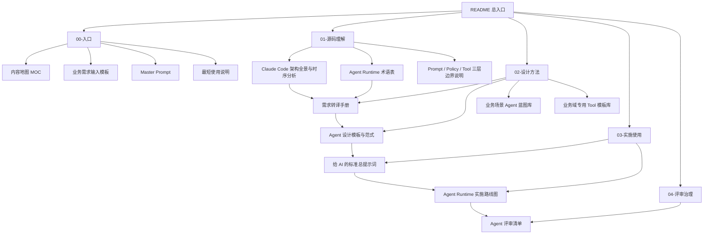

# claude-code-sourcemap-main 知识库 README

## 这是什么

这是一个围绕 `claude-code-sourcemap-main` 整理出来的 Obsidian 知识库。

目标不是只做源码笔记，而是把 Claude Code 的实现经验沉淀成一套可复用的 `Agent Runtime Knowledge Base`，让你后续可以：

1. 系统理解 Claude Code 到底是怎么运转的。
2. 把 Claude Code 抽象成稳定的 runtime 设计语言。
3. 把真实业务需求快速转译成可实现的 agent 架构。
4. 把这套知识库直接喂给 AI，产出更接近 Claude Code 水平的 agent 方案。

---

## 当前分类方式

当前目录不再平铺，而是按“认知阶段”和“工作用途”分成 5 类：

- `00-入口`
  - 面向阅读启动、AI 投喂、需求输入。
- `01-源码理解`
  - 面向 Claude Code 源码与 runtime 抽象理解。
- `02-设计方法`
  - 面向需求转译、方案设计、模式复用。
- `03-实施使用`
  - 面向 AI 实际使用、工程推进、落地执行。
- `04-评审治理`
  - 面向设计评审、边界校正、方案治理。

---

## 目录结构图

```text
claude-code-sourcemap-main/
├── README.md
├── 00-入口/
│   ├── 内容地图 MOC.md
│   ├── 业务需求输入模板.md
│   ├── Master Prompt｜Agent Runtime Architect.md
│   └── 最短使用说明.md
├── 01-源码理解/
│   ├── Claude Code 架构全景与时序分析.md
│   ├── Agent Runtime 术语表.md
│   └── Prompt ／ Policy ／ Tool 三层边界说明.md
├── 02-设计方法/
│   ├── 业务需求到 Agent Runtime 的转译手册.md
│   ├── Agent 设计模板与范式.md
│   ├── 业务场景 Agent 蓝图库.md
│   └── 业务域专用 Tool 模板库.md
├── 03-实施使用/
│   ├── 给 AI 的标准总提示词.md
│   └── Agent Runtime 实施路线图.md
└── 04-评审治理/
    └── Agent 评审清单.md
```

## 知识库结构关系图



---

## 各目录说明

### 00-入口

这一层是知识库入口，不负责解释所有原理，而负责把人和 AI 导入正确工作流。

- [[00-入口/内容地图 MOC|内容地图 MOC]]
  - 从阅读路径角度组织整套知识库。
- [[00-入口/业务需求输入模板|业务需求输入模板]]
  - 以后给 AI 提需求时，优先先填这一页。
- [[00-入口/Master Prompt｜Agent Runtime Architect|Master Prompt｜Agent Runtime Architect]]
  - 最强的总提示词入口。
- [[00-入口/最短使用说明|最短使用说明]]
  - 如果只想最快上手，这一页最直接。

### 01-源码理解

这一层负责回答“Claude Code 到底是怎么回事”。

- [[01-源码理解/Claude Code 架构全景与时序分析|Claude Code 架构全景与时序分析]]
  - 核心母文档，解释源码结构、运行链路、架构设计与时序。
- [[01-源码理解/Agent Runtime 术语表|Agent Runtime 术语表]]
  - 把 Claude Code 里的关键抽象提炼成统一语言。
- [[01-源码理解/Prompt ／ Policy ／ Tool 三层边界说明|Prompt ／ Policy ／ Tool 三层边界说明]]
  - 用来校正 runtime 三层边界，防止设计失真。

### 02-设计方法

这一层负责把“理解 Claude Code”转成“设计你自己的 agent”。

- [[02-设计方法/业务需求到 Agent Runtime 的转译手册|业务需求到 Agent Runtime 的转译手册]]
  - 从业务需求映射到 runtime 对象。
- [[02-设计方法/Agent 设计模板与范式|Agent 设计模板与范式]]
  - 标准化输出 Agent / Tool / Task / Permission 设计。
- [[02-设计方法/业务场景 Agent 蓝图库|业务场景 Agent 蓝图库]]
  - 面向常见业务场景的复用蓝图。
- [[02-设计方法/业务域专用 Tool 模板库|业务域专用 Tool 模板库]]
  - 面向具体业务域的 Tool Spec 模板。

### 03-实施使用

这一层负责真正驱动 AI 和工程实施。

- [[03-实施使用/给 AI 的标准总提示词|给 AI 的标准总提示词]]
  - 把整套方法论压缩成可复用 prompt。
- [[03-实施使用/Agent Runtime 实施路线图|Agent Runtime 实施路线图]]
  - 让设计进入 MVP、Phase 2、Phase 3。

### 04-评审治理

这一层负责方案评审与设计约束。

- [[04-评审治理/Agent 评审清单|Agent 评审清单]]
  - 检查 AI 产出的方案到底是“像样”，还是“真的可落地”。

---

## 推荐阅读顺序

### 路径一：先理解 Claude Code

1. [[01-源码理解/Claude Code 架构全景与时序分析|Claude Code 架构全景与时序分析]]
2. [[01-源码理解/Agent Runtime 术语表|Agent Runtime 术语表]]
3. [[01-源码理解/Prompt ／ Policy ／ Tool 三层边界说明|Prompt ／ Policy ／ Tool 三层边界说明]]

### 路径二：从业务需求反推 agent 设计

1. [[00-入口/业务需求输入模板|业务需求输入模板]]
2. [[02-设计方法/业务需求到 Agent Runtime 的转译手册|业务需求到 Agent Runtime 的转译手册]]
3. [[02-设计方法/Agent 设计模板与范式|Agent 设计模板与范式]]
4. [[02-设计方法/业务场景 Agent 蓝图库|业务场景 Agent 蓝图库]]
5. [[02-设计方法/业务域专用 Tool 模板库|业务域专用 Tool 模板库]]

### 路径三：直接驱动 AI 出方案

1. [[00-入口/业务需求输入模板|业务需求输入模板]]
2. [[00-入口/Master Prompt｜Agent Runtime Architect|Master Prompt｜Agent Runtime Architect]]
3. [[03-实施使用/给 AI 的标准总提示词|给 AI 的标准总提示词]]
4. [[04-评审治理/Agent 评审清单|Agent 评审清单]]

---

## 给 AI 的推荐使用方式

如果你的目标是让 AI 直接帮你设计类似 Claude Code 的 agent runtime，最小上下文建议如下：

1. [[01-源码理解/Agent Runtime 术语表|Agent Runtime 术语表]]
2. [[02-设计方法/业务需求到 Agent Runtime 的转译手册|业务需求到 Agent Runtime 的转译手册]]
3. [[02-设计方法/Agent 设计模板与范式|Agent 设计模板与范式]]
4. [[01-源码理解/Claude Code 架构全景与时序分析|Claude Code 架构全景与时序分析]]
5. 你自己填写好的 [[00-入口/业务需求输入模板|业务需求输入模板]]

如果你想走最短路径：

1. 填 [[00-入口/业务需求输入模板|业务需求输入模板]]
2. 把它和 [[00-入口/Master Prompt｜Agent Runtime Architect|Master Prompt｜Agent Runtime Architect]] 一起喂给 AI
3. 让 AI 输出 runtime 架构
4. 再用 [[04-评审治理/Agent 评审清单|Agent 评审清单]] 回审

---

## Obsidian 阅读建议

- 将本页固定为目录页。
- 优先打开 Backlinks 与 Outgoing links 面板。
- 使用图谱视图查看 `README -> 分类目录 -> 主题文档` 的结构。
- 后续新增文档时，优先放入已有分类，不要重新回到平铺结构。

---

## 入口导航

- 进入内容地图：[[00-入口/内容地图 MOC|内容地图 MOC]]
- 开始理解 Claude Code：[[01-源码理解/Claude Code 架构全景与时序分析|Claude Code 架构全景与时序分析]]
- 开始建立统一术语：[[01-源码理解/Agent Runtime 术语表|Agent Runtime 术语表]]
- 开始做需求转译：[[02-设计方法/业务需求到 Agent Runtime 的转译手册|业务需求到 Agent Runtime 的转译手册]]
- 开始直接设计 agent：[[02-设计方法/Agent 设计模板与范式|Agent 设计模板与范式]]
- 开始直接喂给 AI：[[03-实施使用/给 AI 的标准总提示词|给 AI 的标准总提示词]]
- 开始做工程落地：[[03-实施使用/Agent Runtime 实施路线图|Agent Runtime 实施路线图]]
- 开始做方案评审：[[04-评审治理/Agent 评审清单|Agent 评审清单]]
- 开始填写你的需求：[[00-入口/业务需求输入模板|业务需求输入模板]]
- 直接拿最终总提示词：[[00-入口/Master Prompt｜Agent Runtime Architect|Master Prompt｜Agent Runtime Architect]]
- 走最短路径：[[00-入口/最短使用说明|最短使用说明]]
